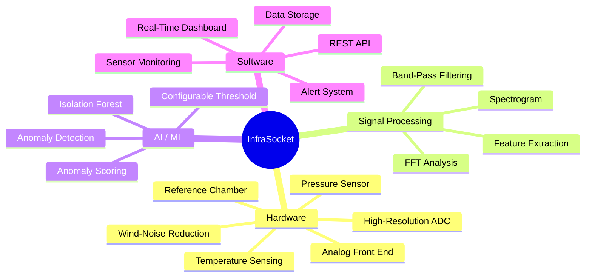

# Key Features

## Feature Overview

## Core Features

### 1. Low-Frequency Pressure Detection (0.01–20 Hz)

The system is designed to detect atmospheric pressure variations in the infrasound range. This is achieved through a combination of:

- A pressure sensor capable of responding to sub-hertz changes
- A differential-pressure reference chamber that suppresses slow barometric drift
- An analog signal chain optimized for very-low-frequency signals

### 2. Wind-Noise Reduction

Wind-induced pressure fluctuations are a major source of interference for infrasound sensors. InfraSocket uses a spatial-averaging manifold with multiple inlet ports to reduce turbulent wind noise while preserving the coherent infrasound signal.

### 3. Differential Pressure with Reference Chamber

A sealed reference chamber connected to the atmosphere through a narrow capillary acts as a mechanical high-pass filter. Slow atmospheric pressure changes equalize through the capillary, while faster infrasound variations appear as a measurable pressure difference across the sensor.

### 4. High-Resolution Digitization

A high-resolution ADC (target: ≥ 16-bit) samples the conditioned analog signal at a rate sufficient to capture the full target frequency range. The digital output feeds directly into the signal-processing pipeline.

### 5. Digital Signal Processing

The system implements a complete signal-processing chain:

| Stage | Function |
|---|---|
| DC offset removal | Centres the signal around zero |
| Band-pass filtering | Isolates the 0.01–20 Hz range |
| Windowing | Prepares segments for spectral analysis |
| FFT | Transforms to frequency domain |
| Spectrogram | Time-frequency visualization |
| Feature extraction | Computes signal characteristics for AI |

### 6. AI-Based Anomaly Detection

An Isolation Forest model trained on normal atmospheric data flags signal windows that deviate significantly from the learned baseline. The system outputs:

- **Anomaly score** — a numerical measure of how unusual a signal window is
- **Classification** — Normal or Anomaly, based on a configurable threshold
- **Alert** — notification when an anomaly is detected

### 7. Real-Time Dashboard

A web-based dashboard displays:

- Live pressure waveform
- Frequency spectrum
- Spectrogram
- Anomaly score with threshold indicator
- Sensor status and health
- Alert history and event timeline

### 8. Temperature Monitoring

A temperature sensor tracks ambient and/or enclosure temperature, enabling:

- Temperature logging alongside pressure data
- Potential temperature-drift compensation
- Environmental condition monitoring

### 9. Modular and Extensible Architecture

Each subsystem (hardware, signal processing, AI, software) is designed as an independent module:

- Hardware can be upgraded without changing software
- Signal-processing algorithms can be replaced or tuned independently
- The AI model can be retrained or swapped
- The dashboard can be extended with new visualizations

## Feature Status

| Feature | Status | Notes |
|---|---|---|
| Pressure sensing | Proposed design | Sensor selection pending |
| Reference chamber | Proposed design | Mechanical design required |
| Wind-noise reduction | Proposed design | Manifold construction required |
| Analog front end | Proposed design | Component selection pending |
| ADC | Proposed design | Resolution/rate to be determined |
| Signal processing | Proposed design | Algorithm selection finalized |
| AI anomaly detection | Proposed design | Isolation Forest selected |
| Dashboard | Proposed design | Technology stack to be finalized |
| Alert system | Proposed design | Notification method to be decided |
| Event classification | `Future Scope` | Requires labeled datasets |
| Multi-sensor array | `Future Scope` | Requires multiple stations |
| Source localization | `Future Scope` | Requires array processing |

---

*See also: [Proposed Solution](proposed-solution.md) | [Scope and Limitations](scope-and-limitations.md)*
