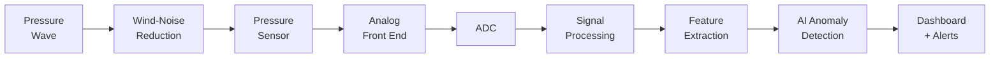
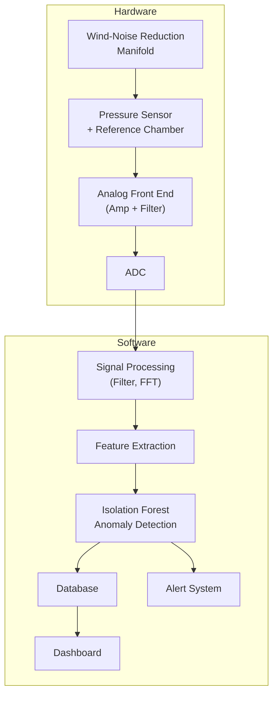

# Proposed Solution

## Overview

InfraSocket addresses the problem of accessible infrasound monitoring by combining custom sensor hardware, digital signal processing, and AI-based anomaly detection into a single integrated prototype system.

The solution is structured as a pipeline:

## Solution Components

### 1. Pressure Sensing with Differential Design

> **Simple Explanation:**
> The sensor measures the difference between the current atmospheric pressure and a stored reference pressure. This way, slow weather-related pressure changes cancel out, and only faster infrasound variations remain.

> **Technical Explanation:**
> A differential pressure transducer is connected to the atmosphere on one side and to a sealed reference chamber on the other. The reference chamber is connected to the atmosphere through a narrow capillary tube (controlled leak) that allows very slow pressure equalization. Pressure changes faster than the equalization time constant appear as a differential signal. This implements a mechanical high-pass filter, suppressing barometric drift below the target frequency range.

### 2. Wind-Noise Reduction via Spatial Averaging

> **Simple Explanation:**
> Wind creates random pressure bumps at a single point. By collecting air pressure from many points spread apart and averaging them together, the random wind bumps cancel out while the real infrasound signal (which is the same everywhere over a small area) remains.

> **Technical Explanation:**
> A rosette or radial manifold with multiple inlet ports (typically 4–8+ ports distributed over a few metres) performs spatial averaging of the incoming pressure field. Wind-induced turbulent pressure fluctuations are spatially incoherent — they differ from point to point. Infrasound signals, with wavelengths of hundreds of metres or more, are spatially coherent across the manifold aperture. Summing multiple incoherent noise sources reduces wind noise by approximately 1/√n (where n is the number of independent inlets), while the coherent signal is preserved.

### 3. Low-Noise Analog Front End

The raw differential pressure signal is typically very small. The analog front end:

- **Amplifies** the signal using an instrumentation amplifier
- **Filters** the signal with an anti-aliasing low-pass filter before digitization
- **Provides a stable DC bias** for the ADC input range

### 4. High-Resolution Digitization

An analog-to-digital converter (ADC) samples the conditioned analog signal. Key requirements:

- Sampling rate ≥ 40 Hz (to satisfy Nyquist criterion for 20 Hz signals)
- Sufficient bit depth (≥ 16 bits recommended) for adequate dynamic range
- Low self-noise to avoid masking weak signals

### 5. Digital Signal Processing Pipeline

Once digitized, the signal passes through:

1. **DC offset removal** — subtract the mean to centre the signal around zero
2. **Band-pass filtering** — isolate the 0.01–20 Hz range
3. **Windowing** — apply a window function (e.g., Hanning) before spectral analysis
4. **FFT** — transform to the frequency domain to identify spectral content
5. **Spectrogram** — create a time-frequency representation
6. **Feature extraction** — compute RMS amplitude, peak frequency, spectral energy, and other features for AI input

> **Important clarification:** FFT and filtering are traditional signal processing, not AI. They are deterministic mathematical operations.

### 6. AI Anomaly Detection (Isolation Forest)

The extracted features from each signal window are fed into an **Isolation Forest** model:

- **Training:** The model is trained on feature vectors from normal (baseline) atmospheric conditions
- **Inference:** For each new signal window, the model computes an normalized anomaly index
- **Decision:** If the normalized anomaly index exceeds a configurable threshold, the system flags an anomaly

> **What this achieves:** The system learns what "normal" looks like and alerts when something "unusual" occurs.
>
> **What this does NOT achieve:** It does not identify what the anomaly is. "Anomaly detected" does not mean "explosion detected" or "meteor detected." Event classification is a separate, more complex problem requiring labeled datasets (`Future Scope`).

### 7. Dashboard and Alerting

A web-based dashboard provides:

- Real-time pressure waveform
- Live frequency spectrum and spectrogram
- Current normalized anomaly index with threshold indicator
- Alert notifications when anomalies are detected
- Historical data browsing
- Sensor health status

## How the Components Work Together

## Why This Solution Is Appropriate for a Prototype

| Design Decision | Rationale |
|---|---|
| Differential pressure with reference chamber | Well-established technique for suppressing barometric drift |
| Spatial-averaging manifold (small scale) | Proven wind-noise reduction principle, scalable to prototype size |
| Isolation Forest for anomaly detection | Works with unlabeled data, computationally lightweight, well-understood |
| Web-based dashboard | Portable, no specialized software needed on the viewing device |
| Modular pipeline | Each component can be tested, validated, and improved independently |

## What Success Looks Like

A successful prototype demonstration would show:

1. A clean waveform captured in a quiet environment
2. Visible noise reduction when the wind manifold is engaged
3. Correct FFT peaks for a known test signal
4. An normalized anomaly index near zero for normal conditions
5. An elevated normalized anomaly index and alert for a controlled test anomaly
6. All of the above visible on the real-time dashboard

---

*See also: [Problem Statement](problem-statement.md) | [Project Objectives](project-objectives.md) | [System Architecture](../02-system-architecture/architecture.md)*
