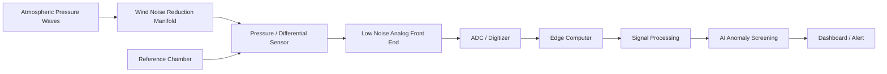
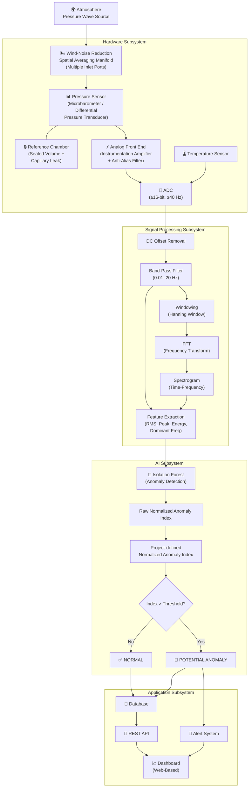
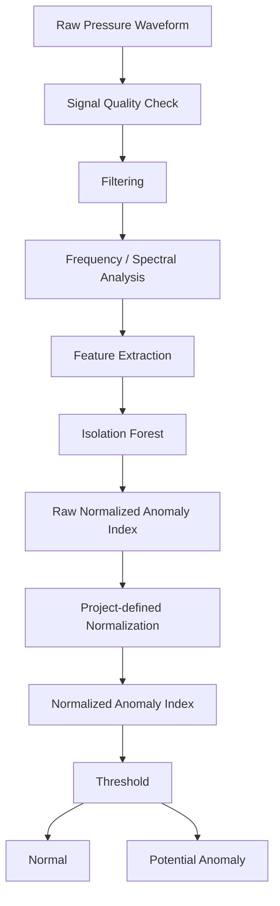

# System Architecture

## Hardware Architecture Diagram



## Complete Architecture Diagram



## Architecture Block Descriptions

### Atmosphere (Source)
The physical environment producing pressure waves. These can originate from natural phenomena (volcanic eruptions, severe storms, meteor entries) or human-made events (explosions, rocket launches). The pressure waves propagate through the atmosphere at approximately the speed of sound.

### Wind-Noise Reduction (Spatial Averaging Manifold)
A physical structure with multiple air inlets distributed over an area. By connecting these inlets to a common manifold, turbulent wind-induced pressure fluctuations (which are spatially incoherent) are averaged out, while the infrasound signal (which is spatially coherent over the manifold aperture) is preserved. This is a purely mechanical/pneumatic noise-reduction technique.

### Pressure Sensor (Microbarometer / Differential Pressure Transducer)
The sensing element that converts atmospheric pressure variations into an electrical signal. For infrasound applications, this is typically a differential pressure sensor — one port is exposed to the atmosphere (via the wind-noise manifold), and the other is connected to the reference chamber.

### Reference Chamber
A sealed volume connected to the atmosphere through a very narrow capillary tube. The capillary allows slow pressure equalization (over minutes), so the reference pressure tracks the barometric mean. Fast pressure variations (infrasound) cannot equalize through the capillary in time, so they appear as a differential pressure across the sensor. This implements a mechanical high-pass filter.

### Analog Front End
Electronic circuitry that:
- **Amplifies** the weak differential-pressure signal using an instrumentation amplifier
- **Filters** the signal with an anti-aliasing low-pass filter (to prevent aliasing during digitization)
- **Biases** the signal to the ADC input range

### ADC (Analog-to-Digital Converter)
Converts the continuous analog signal into discrete digital samples. Key parameters:
- **Sampling rate:** ≥ 40 Hz (to satisfy Nyquist criterion for 20 Hz maximum signal frequency)
- **Resolution:** ≥ 16 bits (to provide adequate dynamic range)

### Temperature Sensor
Monitors ambient or enclosure temperature. Temperature data is logged alongside pressure data and can be used for drift compensation or data quality assessment.

### DC Offset Removal
Subtracts the mean value from the digital signal to centre it around zero. This removes any constant offset from the sensor or electronics.

### Band-Pass Filter (0.01–20 Hz)
A digital filter that passes frequencies within the target infrasound range and attenuates frequencies outside it. The high-pass component near 0.01 Hz attenuates residual barometric drift below the target band. The low-pass component (20 Hz) removes higher-frequency noise and any signals above the infrasound range.

### Windowing (Hanning Window)
Before performing FFT, each data segment is multiplied by a window function (e.g., Hanning/Hann window) to reduce spectral leakage — artefacts caused by analyzing a finite-length signal segment.

### FFT (Fast Fourier Transform)
A mathematical algorithm that transforms the time-domain signal into the frequency domain, revealing which frequencies are present and their relative amplitudes. **FFT is traditional signal processing, not AI.**

### Spectrogram
A time-frequency representation showing how the frequency content of the signal changes over time. Generated by computing FFT on successive overlapping windows.

### Feature Extraction
Computes numerical characteristics of each signal window:
- **RMS amplitude** — overall signal strength
- **Peak amplitude** — maximum excursion
- **Spectral energy** — total energy in the frequency domain
- **Dominant frequency** — frequency with highest energy
- **Spectral centroid** — "centre of mass" of the spectrum
- **Bandwidth** — spread of spectral energy
- **Duration** — length of signal window

### Isolation Forest (Anomaly Detection)
An unsupervised machine-learning algorithm that:
1. Is trained on feature vectors from normal (baseline) atmospheric conditions
2. Assigns a raw normalized anomaly index to each new feature vector based on average path length in its decision trees
3. Anomalies are easier to "isolate" (separate) than normal points, resulting in shorter average path lengths

> **Current AI scope = anomaly screening.** Event classification and multi-source event confirmation are future phases.

### Normalized Anomaly Index Pipeline

The Isolation Forest raw output is processed through a project-defined normalization step:

```text
Feature Vector
      ↓
Isolation Forest
      ↓
Raw Normalized Anomaly Index
      ↓
Project-defined Normalization
      ↓
Normalized Anomaly Index
      ↓
Threshold
      ↓
Normal / Potential Anomaly
```

A configurable threshold determines the decision boundary:
- Index ≤ threshold → **NORMAL**
- Index > threshold → **POTENTIAL ANOMALY**

> **Important:** The normalized anomaly index is a project-defined visualization/decision-support score. It is NOT a probability and must not be interpreted as model confidence. The threshold is an experimental value to be selected using validation data.

### Alert System
When an anomaly is detected, the alert system:
- Generates a notification (e.g., email, webhook, dashboard alert)
- Logs the alert with timestamp, normalized anomaly index, and associated data
- Displays the alert on the dashboard

### Database
Stores:
- Raw measurement data (timestamp, pressure value, temperature)
- Processed signal windows and their features
- Anomaly records (scores, thresholds, status)
- Sensor metadata and configuration

### REST API
Provides programmatic access to stored data and system status. Allows external applications to query measurements, anomalies, and sensor health.

### Dashboard (Web-Based)
Real-time visualization interface showing live waveform, spectrum, spectrogram, normalized anomaly index, alerts, and historical data.

## Multi-Sensor Future Architecture

```text
Node A ─┐
Node B ─┼──> Central Processing ──> Correlation
Node C ─┘                         ↓
                              Event Assessment
```

This future architecture supports localization and improved noise rejection through:
- Time synchronization across nodes
- Cross-correlation of signals
- Arrival-time difference calculations
- Source direction/location estimation

> **Note:** Accurate localization will not be claimed until experimentally validated with a synchronized multi-node array.

## Multi-Source Fusion (Future Scope)

```text
InfraSocket Infrasound
        +
Weather Data
        +
Seismic Data
        +
Satellite / Remote Sensing Data
        ↓
Multi-Source Correlation
        ↓
AI / Statistical Analysis
        ↓
Potential Event Assessment
```

> **Note:** Satellite data and infrasound provide complementary observations. InfraSocket can potentially act as an additional ground-based sensing layer. Satellite and other external data sources are complementary evidence sources, not replacements for direct infrasound measurement. Multi-source fusion remains **Future Scope** unless explicitly implemented.

## AI Processing Pipeline



> **Current AI scope = anomaly screening.** Event classification and multi-source event confirmation are future phases.

## Architecture Principles

1. **Data preservation:** Raw data is always stored, even if processing or AI fails
2. **Graceful degradation:** If the AI subsystem is unavailable, signal processing and data recording continue
3. **Separation of concerns:** Hardware, signal processing, AI, and application layers are independent
4. **Observable:** Every stage produces inspectable output for debugging and validation

---

*See also: [System Overview](system-overview.md) | [Hardware Architecture](hardware-architecture.md) | [Software Architecture](software-architecture.md) | [Data Flow](data-flow.md)*
