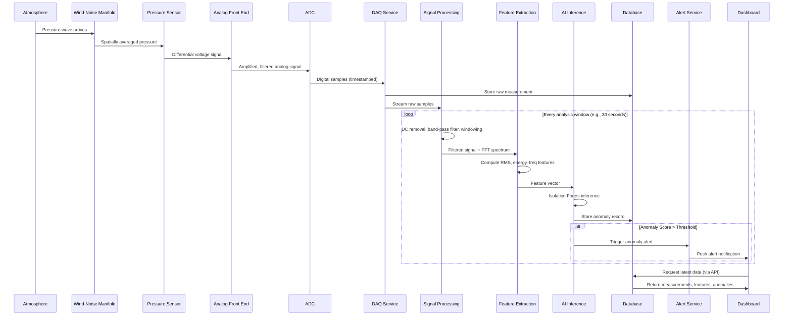
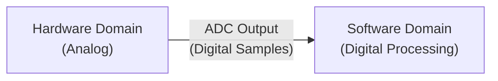
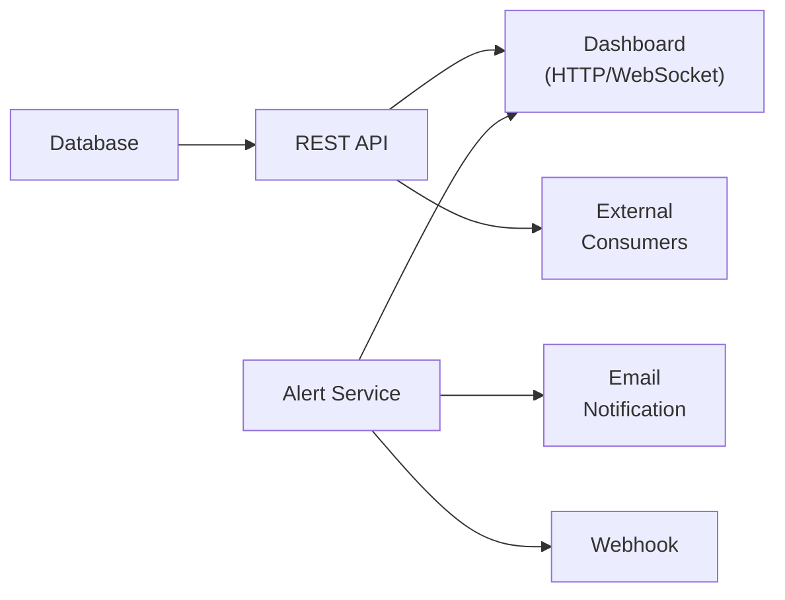

# Component Interaction

## Interaction Diagram



## Component Interfaces

### Hardware ↔ Software Interface

The hardware-software boundary is at the **ADC output**. The DAQ service reads digital samples from the ADC hardware.



**Interface protocol options:**
- SPI (Serial Peripheral Interface) — common for embedded ADCs
- I²C — for lower-speed ADCs and temperature sensors
- USB — for DAQ boards or USB-connected ADCs
- Serial (UART) — for microcontroller-based data acquisition
- Ethernet/TCP — for networked DAQ systems

### Signal Processing ↔ AI Interface

The signal-processing subsystem communicates with the AI subsystem through **feature vectors** — numerical arrays summarizing each analysis window.

```
Feature vector format (proposed):
[rms_amplitude, peak_amplitude, spectral_energy, dominant_frequency, spectral_centroid, bandwidth]
```

This interface is simple and well-defined: the AI model expects a fixed-length numerical array with the same feature order as its training data.

### AI ↔ Application Interface

The AI subsystem outputs:
- **Anomaly score** (float, 0.0–1.0)
- **Decision** (NORMAL or ANOMALY, based on threshold)
- **Metadata** (timestamp, window ID, associated sensor ID)

This output is written to the database and, if anomalous, triggers the alert service.

### Application Layer Internal Interfaces



## Timing and Synchronization

| Component | Timing Characteristic |
|---|---|
| ADC sampling | Fixed rate (e.g., 50 Hz), hardware-clocked |
| Raw data storage | Written as soon as samples are received |
| Signal processing window | Triggered every N seconds (e.g., 30 sec) |
| AI inference | Triggered after each feature extraction |
| Dashboard update | Polled or pushed at 1–5 Hz |
| Alert | Triggered immediately on anomaly detection |

## Error Propagation

| Error Source | Downstream Impact | Handling |
|---|---|---|
| Sensor failure | No new data | DAQ detects missing data, logs error, dashboard shows sensor offline |
| ADC communication error | Data gaps | DAQ retries, logs gaps, marks affected windows as low quality |
| Signal processing error | No features for affected window | Error logged, AI skips window, raw data still saved |
| AI model not loaded | No anomaly detection | System logs warning, continues recording and processing without AI |
| Database write failure | Data at risk | Buffer in memory, retry; alert on persistent failure |

---

*See also: [Architecture](architecture.md) | [Data Flow](data-flow.md) | [Software Architecture](software-architecture.md)*
