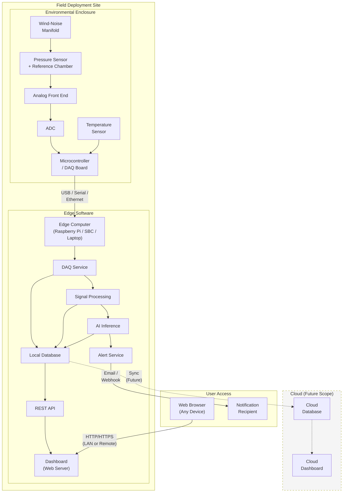
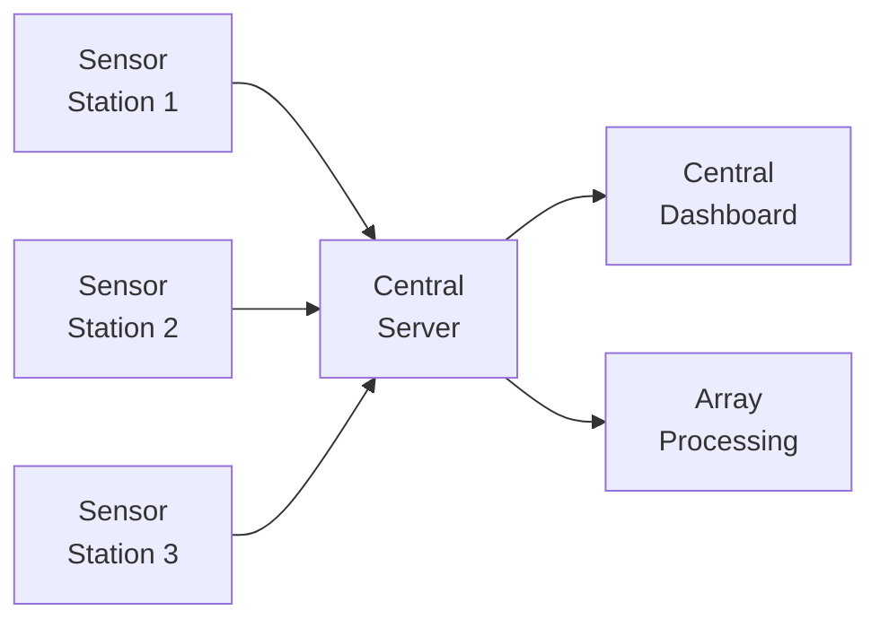
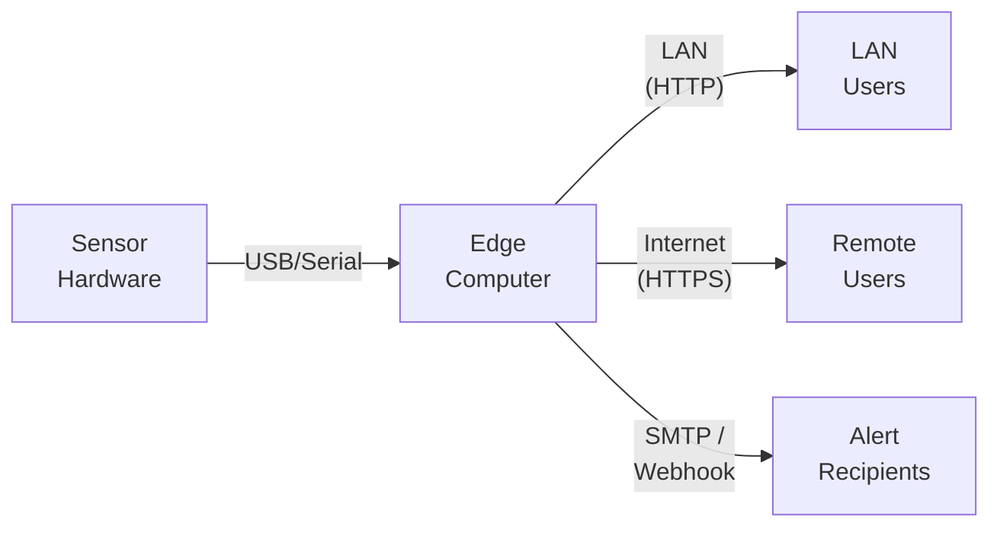

# Deployment Architecture

## Deployment Diagram

## Deployment Configurations

### Configuration 1: Standalone (MVP)

Everything runs on a single edge computer at the deployment site.

| Component | Runs On |
|---|---|
| Sensor + ADC + DAQ board | Connected to edge computer via USB/serial |
| All software services | Edge computer (Raspberry Pi, laptop, or SBC) |
| Database | Local on edge computer |
| Dashboard | Web server on edge computer, accessed via LAN |
| Alerts | Local notifications or email (if internet available) |

**Advantages:** Simple, no internet required, low cost
**Limitations:** Data only accessible on local network

### Configuration 2: Remote Access (Extended)

Same as standalone, but with remote access capability.

| Added Component | Purpose |
|---|---|
| VPN or reverse proxy | Secure remote access to dashboard |
| Cloud database sync | Backup data to cloud storage |
| Remote alerts | Email or webhook notifications |

**Advantages:** Remote monitoring, data backup
**Requirements:** Internet connectivity

### Configuration 3: Multi-Sensor Network (`Future Scope`)

Multiple sensor stations report to a central server.

**Advantages:** Source localization, array processing, network-level analysis
**Requirements:** Multiple stations, network infrastructure, array processing software

## Hardware Requirements for Edge Computer

`Assumption`: These are estimated minimum requirements for the MVP deployment.

| Resource | Minimum | Recommended |
|---|---|---|
| CPU | Single-core, 1 GHz | Quad-core, 1.5 GHz+ |
| RAM | 512 MB | 2 GB+ |
| Storage | 8 GB | 32 GB+ (for long-term recording) |
| Connectivity | USB (for DAQ) | USB + Ethernet/Wi-Fi |
| OS | Linux-based | Raspberry Pi OS, Ubuntu |

Suitable edge computers include:
- Raspberry Pi 4 or later
- Any Linux-capable single-board computer (SBC)
- Laptop (for development and testing)

## Network Architecture

## Physical Deployment Considerations

| Consideration | Guidance |
|---|---|
| **Location** | Away from strong local noise sources (roads, machinery, HVAC). `Assumption`: some level of wind shelter |
| **Elevation** | Ground level or slightly elevated; avoid rooftops in windy areas |
| **Wind exposure** | Partial shelter improves manifold performance; full exposure degrades SNR |
| **Power** | Mains power or sufficiently large battery/solar system for extended operation |
| **Weather protection** | Enclosure must protect electronics; sensor ports must remain open to atmosphere |
| **Security** | Physical security against tampering or theft in outdoor deployments |
| **Maintenance access** | Easy access for calibration, component replacement, and data retrieval |

---

*See also: [Architecture](architecture.md) | [Field Deployment](../10-deployment/field-deployment.md) | [Hardware Deployment](../10-deployment/hardware-deployment.md)*
