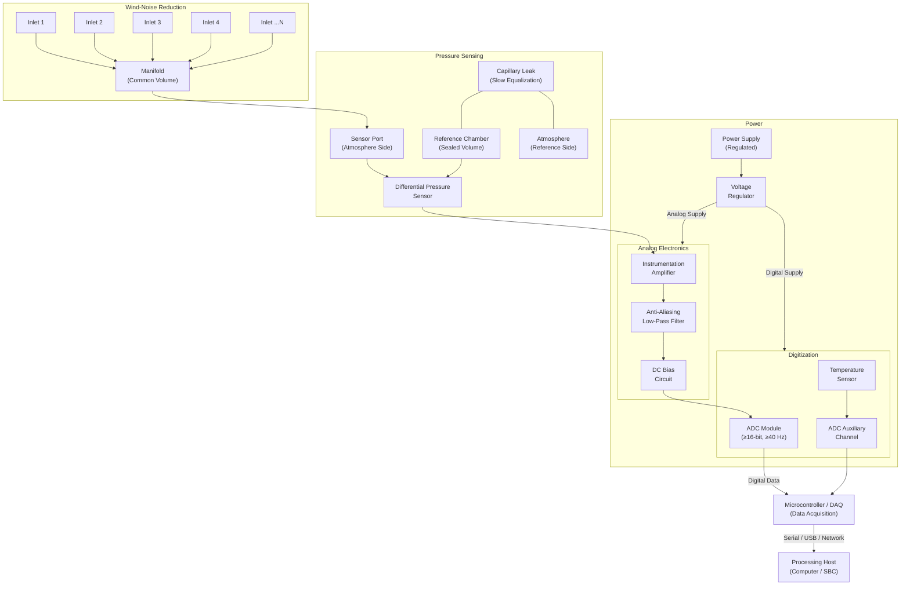

# Hardware Architecture

## Hardware Block Diagram

## Hardware Subsystem Summary

| Subsystem | Function | Key Components |
|---|---|---|
| Wind-noise reduction | Reduce turbulent wind noise | Multi-port manifold, tubing |
| Pressure sensing | Convert pressure to electrical signal | Differential pressure sensor, reference chamber, capillary |
| Analog front end | Amplify and filter the signal | Instrumentation amplifier, passive/active filters |
| Digitization | Convert analog signal to digital | ADC module (≥16-bit) |
| Temperature sensing | Monitor ambient/enclosure temperature | Temperature sensor (thermistor, RTD, or digital) |
| Power system | Provide stable, clean power | Power supply, voltage regulators |
| Enclosure | Protect electronics from environment | Weather-resistant housing |
| Data acquisition | Collect digital data and transmit | Microcontroller or DAQ board |

## Design Considerations

### Signal Path Integrity
The signal path from sensor to ADC must be designed to minimize added noise:
- Keep analog signal traces short
- Separate analog and digital ground planes
- Use shielded cables for the sensor connection
- Place the amplifier physically close to the sensor

### Power Supply Noise
Power supply noise can couple into the analog signal chain. Mitigation strategies:
- Use a linear regulator (not switching regulator) for the analog supply, or adequately filter a switching supply
- Provide separate analog and digital power rails
- Use decoupling capacitors at each IC

### Thermal Management
Temperature changes affect:
- Sensor sensitivity and offset
- Amplifier offset and gain
- Reference chamber pressure (PV = nRT)
- ADC reference voltage

Strategies:
- Thermal insulation of the enclosure
- Temperature monitoring for compensation
- Avoid placing heat-generating components near the sensor

### Mechanical Isolation
Ground vibration and mechanical disturbance can be transmitted to the pressure sensor. Mounting should include vibration isolation where possible.

## Interface Definitions

| Interface | From | To | Signal Type |
|---|---|---|---|
| Pneumatic | Manifold | Sensor port | Air pressure |
| Pneumatic | Capillary | Reference chamber | Slow air equalization |
| Electrical (analog) | Sensor | Instrumentation amplifier | Differential voltage |
| Electrical (analog) | Amplifier | Anti-alias filter | Amplified voltage |
| Electrical (analog) | Filter | ADC | Filtered voltage |
| Electrical (digital) | ADC | Microcontroller/DAQ | SPI / I²C / parallel |
| Electrical (digital) | Temperature sensor | Microcontroller/DAQ | I²C / analog |
| Data | Microcontroller/DAQ | Processing host | Serial / USB / Ethernet |

---

*See also: [Architecture](architecture.md) | [Pressure Sensing](../03-hardware/pressure-sensing.md) | [Analog Front End](../03-hardware/analog-front-end.md)*
