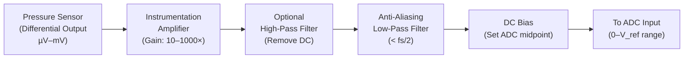

# Analog Front End

## Purpose

The analog front end (AFE) sits between the pressure sensor and the ADC. Its job is to amplify the weak electrical signal from the sensor to a level suitable for digitization, and to filter out frequencies that could cause problems during the analog-to-digital conversion.

## Block Diagram

## Component: Instrumentation Amplifier

### Purpose
Amplifies the weak differential voltage from the pressure sensor while rejecting common-mode noise.

### Working Principle
> **Simple Explanation:**
> The sensor's output is like a very quiet whisper. The instrumentation amplifier is like a hearing aid — it makes the whisper louder without amplifying the background room noise.

> **Technical Explanation:**
> An instrumentation amplifier (INA) has two high-impedance differential inputs and one single-ended output. It amplifies only the difference between its inputs (differential-mode signal) while strongly rejecting any signal that appears equally on both inputs (common-mode signal). The gain is typically set by a single external resistor.

### Key Requirements

| Parameter | Requirement | Reason |
|---|---|---|
| Input offset voltage | Low (< 100 µV) | Prevents large DC offset at output |
| Input offset drift | Low (< 1 µV/°C) | Minimizes temperature-dependent drift |
| Input noise | Low (< 50 nV/√Hz at 1 Hz) | Does not add significant noise to the weak sensor signal |
| CMRR | High (> 80 dB) | Rejects common-mode interference |
| Input impedance | High (> 1 GΩ) | Does not load the sensor |
| Gain range | Adjustable (10× to 1000×) | Matches sensor output to ADC input range |
| Bandwidth | DC to > 100 Hz | Covers the infrasound range with margin |

### Design Considerations
- **1/f noise:** At very low frequencies (< 1 Hz), amplifier noise increases (called 1/f or "flicker" noise). Choose an amplifier with low 1/f noise corner frequency.
- **Gain selection:** The gain should be set so that the expected maximum signal fills a reasonable portion of the ADC's input range without clipping.
- **Power supply rejection:** The amplifier should have high power supply rejection ratio (PSRR) to avoid coupling power supply noise into the signal.

## Component: Anti-Aliasing Low-Pass Filter

### Purpose
Removes frequencies above half the sampling rate (Nyquist frequency) to prevent aliasing during digitization.

### Working Principle
> **Simple Explanation:**
> When you digitize a signal, you take "snapshots" at regular intervals. If there are very fast signal changes happening between snapshots, they can appear as false slow signals (aliases). The anti-aliasing filter removes these fast signals before they cause problems.

> **Technical Explanation:**
> Per the Nyquist-Shannon sampling theorem, a signal must be sampled at more than twice its highest frequency component to be faithfully reconstructed. If frequency components above fs/2 (where fs is the sampling rate) are present during sampling, they are aliased — they appear as spurious lower-frequency components in the digital data. An analog low-pass filter before the ADC prevents this.

### Design Parameters

| Parameter | Value / Guidance |
|---|---|
| Cutoff frequency | Below fs/2 (e.g., if fs = 50 Hz, cutoff ≤ 25 Hz) |
| Filter order | 2nd to 4th order (Butterworth or Bessel preferred) |
| Rolloff | Steeper rolloff provides better alias rejection |
| Passband ripple | Minimal (Butterworth has flat passband; Bessel has linear phase) |

### Filter Type Recommendations

| Type | Advantage | Disadvantage |
|---|---|---|
| Butterworth | Maximally flat passband | Steeper phase shift near cutoff |
| Bessel | Linear phase (preserves waveform shape) | Gentler rolloff |
| Sallen-Key topology | Simple to implement with op-amps | Sensitivity to component tolerance |

For infrasound applications, a **Bessel filter** is often preferred because it has linear phase response, which means it preserves the time-domain waveform shape — important for interpreting transient infrasound events.

## Component: DC Bias Circuit

### Purpose
Shifts the signal to the centre of the ADC's input range. Many ADCs accept only positive voltages (e.g., 0 to 3.3 V), but the amplified sensor signal may swing symmetrically around zero (±V).

### Implementation
A precision voltage divider or voltage reference provides a DC offset equal to half the ADC's reference voltage. The signal rides on top of this offset.

## Noise Budget

The overall noise floor of the analog front end is determined by the noisiest component — typically the first-stage amplifier or the sensor itself.

| Noise Source | Contribution |
|---|---|
| Sensor self-noise | Fundamental limit |
| Instrumentation amplifier input noise | Dominates if sensor noise is low |
| Resistor thermal noise (Johnson noise) | Generally small for reasonable resistor values |
| Power supply noise | Can be significant without proper filtering |
| PCB layout noise (ground loops, crosstalk) | Depends on physical design |

**Key principle:** Minimize noise at the first stage (sensor + amplifier). Noise added later in the chain is less significant because it is not amplified.

## Prototype Approach

For the MVP prototype, the analog front end complexity depends on the chosen sensor:

- **If using a sensor with analog output:** A separate instrumentation amplifier and filter circuit is needed.
- **If using a sensor with built-in signal conditioning and digital output (I²C/SPI):** The analog front end is internal to the sensor module, and the prototype connects directly to the digital output.

`Assumption`: If a digital-output sensor is used, the analog front-end section describes the internal signal conditioning for understanding purposes. The external circuit is simplified.

---

*See also: [Pressure Sensing](pressure-sensing.md) | [ADC / Digitization](adc-digitization.md) | [Hardware Overview](hardware-overview.md)*
