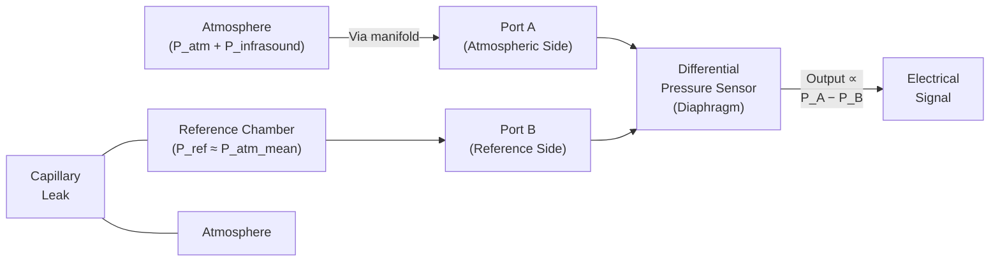

# Differential Pressure System

## Purpose

The differential pressure system measures the **difference** between two pressures rather than measuring absolute atmospheric pressure. This is critical for infrasound detection because it naturally suppresses the large, slow-changing background atmospheric pressure (approximately 101,325 Pa) while remaining sensitive to small, faster pressure variations (the infrasound signal).

## Working Principle

> **Simple Explanation:**
> Imagine two rooms separated by a flexible wall. If both rooms are at the same pressure, the wall stays flat. If one room has slightly more pressure, the wall bends toward the lower-pressure room. A differential pressure sensor works like that flexible wall — it only responds to the *difference* between two pressures, ignoring the large common pressure that both sides share.

> **Technical Explanation:**
> A differential pressure sensor has two pressure ports:
> - **Port A (Positive/High):** Connected to the atmosphere (via the wind-noise manifold)
> - **Port B (Negative/Low/Reference):** Connected to the reference chamber
>
> The sensor diaphragm is exposed to pressure from both ports simultaneously. Only the difference (P_A − P_B) causes the diaphragm to deflect. Since the reference chamber slowly equalizes with the atmosphere through a capillary leak, the differential pressure represents only the faster pressure variations — exactly the infrasound signal we want to capture.

## System Diagram



## Why Differential Measurement Is Essential

### Problem: Barometric Pressure is Enormous
Standard atmospheric pressure is approximately 101,325 Pa (1013.25 hPa). An infrasound signal might have an amplitude of 0.01 to 10 Pa. This means the signal is roughly **10,000 to 10,000,000 times smaller** than the background pressure.

### Problem: Barometric Pressure Changes Slowly
Weather systems, diurnal heating, and altitude changes cause the atmospheric pressure to vary by hundreds of Pascals over hours. These slow changes would completely overwhelm the tiny infrasound signal if measured on an absolute scale.

### Solution: Differential Measurement
By measuring pressure relative to a slowly tracking reference, the large common-mode atmospheric pressure is cancelled. Only the differential signal — the fast pressure variation (infrasound) — remains.

```
Absolute measurement:  P_measured = P_atm_mean + P_weather_drift + P_infrasound
                       ↑ ~101,325 Pa   ↑ ~100s Pa        ↑ ~0.01–10 Pa

Differential measurement: ΔP = P_atmosphere − P_reference
                          ΔP ≈ P_infrasound  (if reference tracks the mean)
```

## Behaviour at Different Frequencies

| Frequency Range | Atmospheric Pressure | Reference Chamber Pressure | Differential Output |
|---|---|---|---|
| Very slow (< 0.001 Hz, weather) | Changes by 100s of Pa | Equalizes through capillary → follows atmosphere | ≈ 0 (suppressed) |
| Target range (0.01–20 Hz, infrasound) | Changes by fractions to Pascals | Cannot equalize fast enough → lags behind | ≈ P_infrasound (detected) |
| Higher frequency (> 20 Hz) | Small changes | Negligible equalization | Present but filtered by electronics |

## Key Design Parameters

| Parameter | Design Consideration |
|---|---|
| Reference chamber volume | Larger volume → slower equalization → lower cutoff frequency |
| Capillary bore diameter | Smaller bore → more restriction → slower equalization |
| Capillary length | Longer capillary → more restriction → slower equalization |
| Time constant | τ = R × V (acoustic resistance × chamber volume) determines the high-pass corner frequency |
| Corner frequency | f_c = 1 / (2π × τ); sets the lower bound of frequency response |

## Common-Mode Rejection

The differential sensor naturally rejects any pressure that appears equally on both ports. This common-mode rejection is important because:

- Absolute atmospheric pressure changes affect both sides equally (via the slow capillary equalization)
- Any mechanical vibration that pressurizes both sides equally is also rejected
- Only the differential component — the infrasound arriving through the manifold — produces an output

## Limitations

1. **Imperfect equalization:** The capillary leak is an approximation; very slow infrasound near the corner frequency is partially attenuated
2. **Temperature sensitivity:** Gas in the reference chamber expands/contracts with temperature (PV = nRT), creating a spurious differential signal
3. **Capillary clogging:** Moisture or debris in the capillary can change its resistance, altering the corner frequency
4. **Limited range:** Differential sensors have a much smaller measurement range than absolute sensors; overpressure protection is needed

---

*See also: [Reference Chamber](reference-chamber.md) | [Pressure Sensing](pressure-sensing.md) | [Calibration](calibration.md)*
