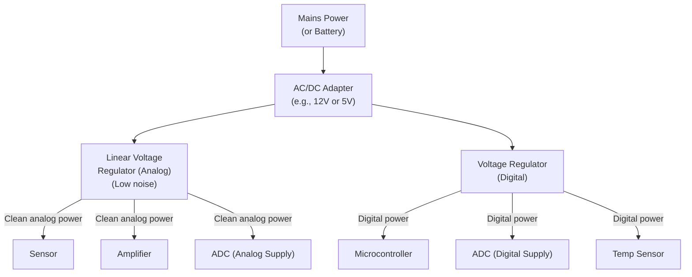

# Power System

## Purpose

The power system provides clean, stable electrical power to all electronic components. Power supply noise can directly contaminate the measured signal, making power design critical for a low-noise measurement system.

## Power Requirements

| Component | Typical Voltage | Current (est.) | Noise Sensitivity |
|---|---|---|---|
| Pressure sensor | 3.3 V or 5 V | 1–10 mA | High |
| Instrumentation amplifier | ±5 V or 3.3 V | 1–5 mA | Very high |
| ADC | 3.3 V or 5 V | 1–10 mA | High |
| Temperature sensor | 3.3 V | < 1 mA | Low |
| Microcontroller / DAQ | 3.3 V or 5 V | 50–500 mA | Medium |
| Edge computer (if used) | 5 V (USB) | 0.5–3 A | Low (digital) |

`Assumption`: Exact current requirements depend on selected components. Values above are approximate ranges.

## Power Architecture

## Design Principles

### Separate Analog and Digital Power
Digital circuits (microcontrollers, communication interfaces) generate high-frequency switching noise that can couple into the analog measurement chain. Using separate voltage regulators for analog and digital circuits minimizes this coupling.

### Linear Regulators for Analog
Linear voltage regulators produce very clean output with minimal high-frequency noise. Switching regulators (DC-DC converters) are more efficient but produce significant switching noise that is difficult to filter completely. For the analog supply, a linear regulator is strongly preferred.

### Decoupling
Every IC should have a ceramic decoupling capacitor (100 nF typical) placed as close as possible to its power pin.

### Ground Plane
Use a solid ground plane. If separate analog and digital grounds are used, connect them at a single point near the ADC.

## Power Source Options

| Source | Advantages | Disadvantages |
|---|---|---|
| Mains AC/DC adapter | Continuous, reliable | Requires mains power at site |
| Battery (lead-acid/Li-ion) | Portable, no mains needed | Limited runtime, needs charging |
| Solar + battery | Extended off-grid operation | Complex, weather-dependent |
| USB power bank | Simple, portable | Limited capacity, may introduce noise |

**Prototype recommendation:** A mains-powered AC/DC adapter (e.g., 12 V) with on-board linear regulators provides the simplest and cleanest power solution for indoor or lab testing. For field deployment, battery backup (UPS) is recommended.

## Power Failure Handling

- The system should detect power loss and perform a graceful shutdown if possible
- A UPS (uninterruptible power supply) or supercapacitor can provide brief holdover power for safe database closure
- Data written before the power failure is preserved; data during the outage is lost

---

*See also: [Analog Front End](analog-front-end.md) | [Hardware Overview](hardware-overview.md)*
