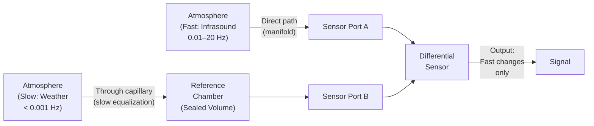

# Reference Chamber

## Purpose

The reference chamber provides a stable reference pressure for the differential pressure sensor. It is the key mechanism that allows the system to suppress slow atmospheric pressure drift while remaining sensitive to faster infrasound pressure variations.

## How It Works

> **Simple Explanation (Analogy):**
> Imagine you are in a room with a very small keyhole as the only opening to the outside. If someone slams a door outside (a fast event), you feel the pressure change immediately — the air cannot rush through the tiny keyhole fast enough to equalize. But if the weather changes slowly over hours, air gradually seeps in and out through the keyhole, so the room pressure keeps up with the outside. The reference chamber works the same way — it "ignores" slow pressure changes but "feels" fast ones.

> **Technical Explanation:**
> The reference chamber is a sealed volume connected to the atmosphere through a narrow capillary tube (controlled acoustic leak). The capillary has a high acoustic resistance — it severely restricts airflow. This creates an RC-like time constant:
>
> - **R** = acoustic resistance of the capillary (depends on diameter, length, and air viscosity)
> - **C** = acoustic compliance of the chamber volume (depends on volume and atmospheric pressure)
> - **τ = R × C** = time constant
>
> For pressure changes that are much faster than τ (i.e., infrasound), the reference pressure cannot equalize in time — the chamber acts as a "frozen" reference. For pressure changes much slower than τ (weather, barometric drift), the reference pressure fully equalizes — the chamber tracks the atmospheric mean.
>
> This implements a **mechanical high-pass filter** with a corner frequency f_c = 1 / (2πτ).

## Conceptual Diagram



## Design Parameters

### Chamber Volume

- **Larger volume** → larger acoustic compliance → lower corner frequency → can measure lower frequencies
- **Smaller volume** → higher corner frequency → loses sensitivity to the lowest frequencies

`Assumption`: The target corner frequency is approximately 0.01 Hz or lower, which requires a sufficiently large chamber volume combined with a restrictive capillary.

### Capillary Dimensions

| Parameter | Effect of Increasing |
|---|---|
| Length | Increases resistance → lowers corner frequency |
| Bore diameter | Decreases resistance → raises corner frequency |

The capillary is typically a narrow tube (sub-millimetre bore) of several centimetres to tens of centimetres in length. The exact dimensions depend on the desired time constant and the chamber volume.

### Time Constant Relationship

```
τ = R_capillary × C_chamber

f_corner = 1 / (2π × τ)

To achieve f_corner = 0.01 Hz:
τ = 1 / (2π × 0.01) ≈ 16 seconds
```

`Assumption`: For a target corner frequency of approximately 0.01 Hz, the time constant needs to be approximately 16 seconds. The specific capillary dimensions and chamber volume to achieve this will need to be determined experimentally, as the acoustic resistance of a capillary depends on its exact geometry and the viscosity of air.

## Frequency Response Effect

The reference chamber creates a high-pass response in the overall sensor system:

| Frequency | Behaviour | Signal Output |
|---|---|---|
| << f_corner (e.g., weather drift) | Reference fully equalizes with atmosphere | ≈ 0 (suppressed) |
| ≈ f_corner (e.g., 0.01 Hz) | Reference partially equalizes | Attenuated (−3 dB at corner frequency) |
| >> f_corner (e.g., 1–20 Hz infrasound) | Reference cannot equalize | Full signal passes through |

## Practical Construction

### Materials
- **Chamber body:** Can be constructed from any rigid, airtight material (metal, thick-walled plastic, glass jar). The material must not flex under small pressure changes.
- **Capillary:** Medical-grade capillary tubing, hypodermic needle tubing, or precision-bore glass tubing. The bore must be small and well-controlled.
- **Seals:** All joints must be airtight. Epoxy, silicone sealant, or compression fittings can be used.

### Size Guidance

`Assumption`: These are approximate starting points for prototyping. Actual dimensions require tuning based on measured frequency response.

| Parameter | Approximate Range |
|---|---|
| Chamber volume | 0.5 to 5 litres |
| Capillary bore | 0.1 to 0.5 mm |
| Capillary length | 5 to 50 cm |

### Assembly Considerations
1. The chamber must be rigid — it should not deform under the small pressure differentials being measured
2. The capillary must be straight and free of obstructions
3. A small filter (mesh or sintered filter) at the capillary inlet prevents dust and moisture from entering
4. The connection between the chamber and the sensor's reference port must be airtight

## Limitations

1. **Temperature sensitivity:** As temperature changes, the gas inside the sealed chamber expands or contracts (PV = nRT). This creates a spurious pressure change that the sensor detects. Thermal insulation helps but does not eliminate this effect.

2. **Capillary clogging:** Moisture condensation, dust, or insects can partially block the capillary, changing the effective resistance and shifting the corner frequency.

3. **Finite suppression:** The reference chamber does not perfectly suppress all slow pressure changes — it is a first-order high-pass filter, meaning suppression is gradual, not abrupt.

4. **Volume stability:** If the chamber material is not sufficiently rigid, the chamber itself acts as an additional compliance, potentially altering the frequency response.

## Testing the Reference Chamber

To verify that the reference chamber is functioning correctly:

1. **Seal test:** Seal the capillary completely and apply a small pressure step. The sensor should show a sustained output (the reference cannot equalize).

2. **Time constant test:** Apply a step pressure change and observe how quickly the sensor output decays. The decay time constant should match the design target.

3. **Frequency response test:** Apply known sinusoidal pressure signals at various frequencies and measure the sensor output amplitude at each frequency.

---

*See also: [Differential Pressure System](differential-pressure-system.md) | [Pressure Sensing](pressure-sensing.md) | [Calibration](calibration.md)*
