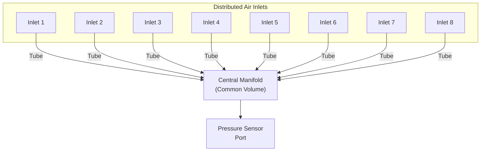

# Wind-Noise Reduction

## Why Wind Noise Is a Problem

> **Simple Explanation:**
> Wind flowing over the sensor's pressure port creates chaotic, swirling pressure changes — like the buffeting sound you hear when you hold your hand out of a car window. These turbulent pressure fluctuations can be much larger than the infrasound signal we are trying to measure. Without noise reduction, the wind noise completely hides the infrasound.

> **Technical Explanation:**
> Atmospheric turbulence creates spatially and temporally varying pressure fluctuations at the ground surface. The power spectral density of wind-generated pressure noise follows approximately a −5/3 power law and can exceed the amplitude of infrasound signals by orders of magnitude at frequencies below a few hertz. Since the target infrasound frequency range (0.01–20 Hz) overlaps with the dominant frequency range of turbulent wind noise, frequency-domain filtering alone cannot separate wind noise from the signal of interest.

## Key Insight: Spatial Coherence

The critical difference between infrasound signals and wind noise is their **spatial coherence**:

| Property | Infrasound Signal | Wind Noise |
|---|---|---|
| **Spatial coherence** | Coherent over hundreds of metres (wavelength: 17 m at 20 Hz to 34,000 m at 0.01 Hz) | Incoherent over distances > few metres |
| **Nature** | Acoustic wave with consistent wavefront | Turbulent pressure fluctuations, random in space |
| **Behaviour across multiple points** | Same signal at all nearby points (within the coherence length) | Different at each point |

This difference is the basis for wind-noise reduction through **spatial averaging**.

## How a Spatial-Averaging Manifold Works

### Concept

Multiple air inlets are distributed over an area and connected through tubing to a common manifold (mixing volume). The pressure at the sensor port is the average of pressures at all inlets.



### Why This Works

1. **Wind noise at different inlets is different** (spatially incoherent). When averaged, the random fluctuations partially cancel out.

2. **Infrasound at different inlets is the same** (spatially coherent over the manifold aperture). When averaged, the coherent signal is preserved.

3. **Theoretical noise reduction:** For n independent inlets, incoherent noise power is reduced by a factor of n, and noise amplitude by √n. So 8 inlets could reduce wind noise amplitude by approximately √8 ≈ 2.8× (about 9 dB).

### Practical Implementation

#### Rosette Configuration
A common layout is a rosette (star) pattern where tubes radiate outward from a central point. Each tube has inlet ports at its end or along its length.

```
Top View of Rosette Manifold:

        Inlet
         |
  Inlet--+--Inlet
        /|\
       / | \
  Inlet  |  Inlet
         |
        Inlet

  All tubes connect to central manifold
```

#### Radial Line Configuration
Tubes are arranged in straight lines radiating from the center, with multiple inlet ports along each tube.

#### Key Dimensions

| Parameter | Effect | Typical Range (Professional IMS-scale) | Prototype Scale |
|---|---|---|---|
| Wind-noise manifold diameter | Larger = better low-frequency noise reduction | 18–70 m (per individual station manifold) | 1–5 m (initial engineering range) |
| Number of inlets | More = better noise reduction | 96–144 | 4–12 (initial engineering range) |
| Tube diameter | Affects acoustic response | 25–50 mm | 5–15 mm (initial engineering range) |
| Tube length (total) | Affects resonances | Up to hundreds of metres | 1–5 m per arm (initial engineering range) |

> **Important:** The above prototype-scale values are initial engineering ranges — to be experimentally optimized. They are NOT final specifications.

> **Important:** Professional IMS stations use manifolds/pipe arrays spanning 18 to 70 metres with nearly 100 inlet ports. A prototype-scale manifold (1–5 metres) will provide some noise reduction but significantly less than a professional system. This is an expected limitation.

### Array Aperture vs. Wind-Noise Manifold

> **Array aperture and individual wind-noise-reduction manifold/rosette dimensions are different parameters and must not be treated as interchangeable.**

```text
Wind-noise manifold / rosette (metres)
        ↓
Local sensor-level turbulence reduction
(single station / single sensor)

Multiple sensor stations (kilometres apart)
        ↓
Array aperture
        ↓
Spatial signal detection / direction estimation
```

- **Wind-noise manifold:** Reduces turbulent pressure fluctuations at a single sensor's location. Prototype scale: 1–5 m.
- **Array aperture:** The physical separation between multiple independent sensor stations, used for cross-correlation and source direction estimation. Professional IMS arrays span 1–3 km between stations. This is a future multi-node capability, not an individual sensor feature.

> Professional IMS array apertures of 1–3 km refer to the spacing between multiple sensor stations, not the size of an individual wind-noise manifold. These must not be conflated with InfraSocket’s prototype manifold dimensions.

## Performance Characteristics

### Noise Reduction Effectiveness

The noise reduction depends on:

1. **Number of inlets (n):** More inlets = more averaging = better reduction
2. **Inlet spacing:** Must be larger than the correlation length of wind turbulence (typically > 1 metre)
3. **Manifold aperture:** Must be small compared to the infrasound wavelength (always true for prototype scale)
4. **Wind speed:** Higher wind = more turbulence = larger noise to begin with
5. **Terrain:** Rough terrain creates more turbulence

### Corner Frequency

The manifold has a "corner frequency" below which noise reduction becomes effective. This is related to the wind speed and array diameter:

```
f_corner ≈ v_wind / (2 × D)

Where:
  v_wind = wind speed (m/s)
  D = array diameter (m)
```

For a 3-metre prototype array in 5 m/s wind: f_corner ≈ 5/(2×3) ≈ 0.8 Hz

This means the prototype manifold will primarily reduce wind noise above ~0.8 Hz. Below this frequency, the manifold aperture is too small relative to the turbulence correlation length to provide significant averaging.

## Limitations

1. **Prototype-scale manifolds provide limited noise reduction** — especially at the lowest frequencies (< 1 Hz) where large apertures are needed
2. **Tube resonances** — the tubing can introduce acoustic resonances if not properly dampened (capillary inserts or porous plugs help)
3. **Tube response time** — long or narrow tubes slow the pressure response, potentially attenuating higher frequencies
4. **Maintenance** — inlets must be protected from clogging by debris, insects, or water
5. **Physical space** — even a small manifold requires a few metres of outdoor space

## Prototype Construction Guidance

| Component | Material | Notes |
|---|---|---|
| Tubes | Flexible or rigid tubing (silicone, PVC, copper) | Diameter 5–15 mm |
| Inlets | Open tube ends, optionally with mesh filter | Protected from rain and debris |
| Central manifold | T-connectors, cross connectors, or a small sealed chamber | All tubes converge here |
| Damping inserts | Porous foam or capillary inserts | Optional, to reduce resonances |
| Mounting | Ground-level, staked or weighted | Consistent height across all inlets |

## Comparison: With and Without Wind-Noise Reduction

| Condition | Without Manifold | With Manifold |
|---|---|---|
| Calm conditions | Low wind noise | Similar (little noise to reduce) |
| Light wind (< 3 m/s) | Moderate wind noise | Noticeable improvement |
| Moderate wind (3–10 m/s) | High wind noise, may obscure signal | Improvement proportional to √n |
| High wind (> 10 m/s) | Signal likely buried | Some improvement, but may still be noisy |

> The manifold does not eliminate wind noise — it reduces it. In strong wind, even with a manifold, infrasound signals may be difficult to detect. This is a fundamental physical limitation.

---

*See also: [Hardware Overview](hardware-overview.md) | [Pressure Sensing](pressure-sensing.md) | [Environmental Enclosure](environmental-enclosure.md)*
