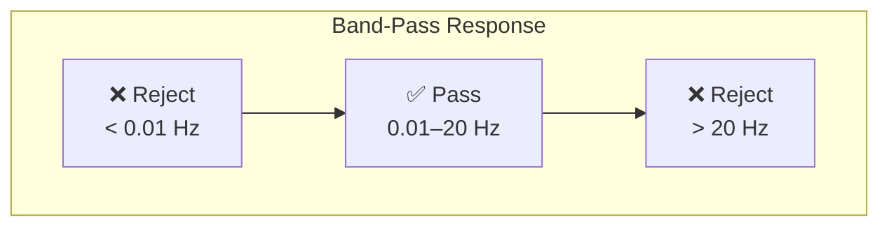

# Filtering

## Purpose

Digital filtering isolates the infrasound frequency band (0.01–20 Hz) from the raw digital signal, removing unwanted components such as DC offset, residual barometric drift, and higher-frequency noise.

## Filter Types Used

### 1. High-Pass Filter (HPF)

**Purpose:** Removes very-low-frequency content below the target range (< 0.01 Hz), including residual barometric drift that the reference chamber did not fully suppress.

**Cutoff frequency:** ~0.01 Hz (or slightly lower to avoid attenuating the lowest infrasound frequencies)

**Challenge:** Implementing a digital high-pass filter at 0.01 Hz is difficult because the time constant is very long (100 seconds per cycle). The filter needs many samples of history to operate effectively.

### 2. Low-Pass Filter (LPF)

**Purpose:** Removes frequencies above the infrasound range (> 20 Hz), including any residual noise from electronics, mains hum (50/60 Hz), and other high-frequency interference.

**Cutoff frequency:** ~20 Hz

This is simpler to implement than the high-pass filter because the cutoff frequency is well above the sub-hertz range.

### 3. Band-Pass Filter (BPF)

**Purpose:** Combines high-pass and low-pass filtering into a single operation, passing only the 0.01–20 Hz range.



## Filter Design Parameters

| Parameter | Value | Notes |
|---|---|---|
| Type | IIR (Infinite Impulse Response) | Efficient, low computational cost |
| Topology | Butterworth or Bessel | Butterworth: flat passband; Bessel: linear phase |
| Order | 4th order (2nd order per section) | Good balance of selectivity and stability |
| High-pass cutoff | 0.01 Hz | Very long time constant |
| Low-pass cutoff | 20 Hz | |
| Sampling rate | 50 Hz | |

## Filter Implementation Considerations

### IIR vs. FIR Filters

| Characteristic | IIR (Infinite Impulse Response) | FIR (Finite Impulse Response) |
|---|---|---|
| Computational cost | Low (few coefficients) | High (many coefficients needed for low frequencies) |
| Phase response | Non-linear (unless Bessel) | Can be linear phase |
| Stability | Must be designed carefully | Always stable |
| Suitability for 0.01 Hz | Practical (few coefficients) | Impractical (would need thousands of taps) |

**Recommendation:** Use **IIR filters** for the prototype because implementing a 0.01 Hz FIR filter at 50 Hz sampling would require an impractically large number of filter taps.

### Numerical Stability

IIR filters with very low cutoff frequencies (relative to the sampling rate) can have numerical stability issues. Mitigation:
- Use **second-order sections (SOS)** form instead of transfer function form
- Use **double-precision floating-point** arithmetic
- Cascade multiple lower-order sections rather than using a single high-order filter

### Transient Response

When the filter first starts processing data (or after a gap), the output goes through a transient settling period. The length of this transient depends on the filter's time constant — for a 0.01 Hz high-pass filter, the settling time can be several minutes. Data during this transient period should be discarded or flagged.

## DC Offset Removal

Before or as part of filtering, the DC offset (constant component) of the signal is removed:

```
x_centered[n] = x[n] − mean(x)
```

The mean can be computed as:
- A fixed mean over a calibration period
- A running mean (essentially a very-low-frequency high-pass filter)
- Removed by the high-pass filter itself

## Practical Filter Application

The filtering is applied to the raw digital samples in real-time:

```
For each new sample x[n]:
    1. Apply high-pass filter → removes DC and drift
    2. Apply low-pass filter → removes high-frequency noise
    (Or apply both as a single band-pass filter)
    Output: filtered sample y[n]
```

---

*See also: [Signal Processing Overview](signal-processing-overview.md) | [FFT Analysis](fft-analysis.md) | [Noise Reduction](noise-reduction.md)*
