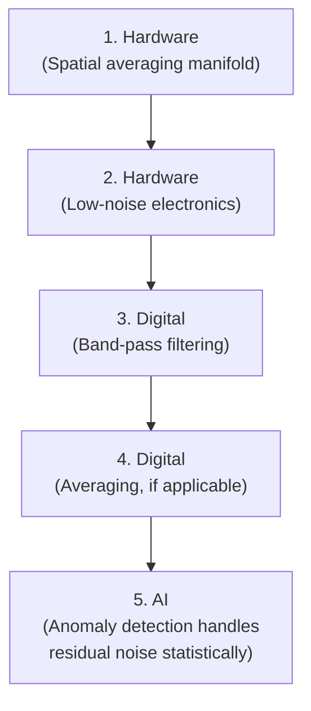

# Noise Reduction

## Sources of Noise in the InfraSocket System

| Noise Source | Nature | Frequency Range | Mitigation |
|---|---|---|---|
| Wind turbulence | Spatially incoherent pressure fluctuations | Broadband, dominant below a few Hz | Spatial-averaging manifold (hardware) |
| Electronic noise (thermal) | Random electron motion in components | Broadband | Low-noise amplifier selection |
| 1/f (flicker) noise | Amplifier and sensor low-frequency noise | Increases at lower frequencies | Low-noise amplifier with low 1/f corner |
| Quantization noise | ADC digitization error | Broadband (white) | Higher bit-depth ADC |
| Mains hum | Power supply coupling | 50 or 60 Hz (and harmonics) | Power supply filtering, shielding |
| Mechanical vibration | Ground or structure vibration | Variable | Vibration isolation |
| Temperature-induced drift | Thermal expansion, gas law effects | Very low frequency | Thermal insulation, compensation |

## Digital Noise Reduction Techniques

### 1. Band-Pass Filtering (Primary)
The most effective digital noise reduction is the band-pass filter, which eliminates all noise outside the 0.01–20 Hz target band. This removes mains hum, high-frequency electronic noise, and much of the thermal drift.

### 2. Averaging
Averaging multiple signal windows reduces random noise:

```
Noise reduction from averaging n windows: √n
```

However, averaging also reduces time resolution — averaged data cannot detect short-duration events.

### 3. Median Filtering
Replacing each sample with the median of surrounding samples effectively removes impulse noise (short spikes). Useful as a preprocessing step if the data contains digital glitches.

### 4. Adaptive Filtering (`Future Scope`)
If a separate noise reference is available (e.g., a second sensor without a manifold), adaptive filtering can estimate and subtract the noise component from the signal. This technique can provide superior noise reduction but requires additional hardware.

## Noise Floor Characterization

The noise floor is the level of noise present when no infrasound signal is applied. It defines the minimum detectable signal.

Measuring the noise floor:
1. Seal or cap the sensor in a quiet environment
2. Record data for an extended period (30+ minutes)
3. Compute the power spectral density (PSD) of the recorded data
4. The PSD represents the noise floor as a function of frequency

The noise floor typically increases at lower frequencies (due to 1/f noise and thermal drift), making very-low-frequency detection inherently more challenging.

## Signal-to-Noise Ratio (SNR)

```
SNR = Signal Power / Noise Power

SNR (dB) = 10 × log10(Signal Power / Noise Power)
```

A signal is detectable when SNR > 1 (or > 0 dB). For reliable detection with low false alarm rate, higher SNR is needed.

## Noise Reduction Hierarchy

The most effective noise reduction combines hardware and software techniques:



Each stage reduces noise further, but the hardware stages are the most important — noise that is not removed in hardware cannot be fully recovered in software.

---

*See also: [Signal Processing Overview](signal-processing-overview.md) | [Filtering](filtering.md) | [Wind-Noise Reduction](../03-hardware/wind-noise-reduction.md)*
