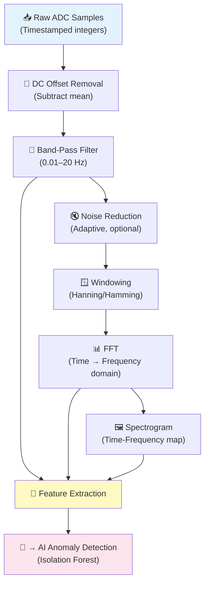

# Signal Processing Overview

## Introduction

Signal processing is the bridge between raw digitized sensor data and the AI anomaly detection system. It transforms noisy, unprocessed ADC samples into clean, meaningful features that the AI model can analyze.

> **Critical Distinction:**
> Signal processing (filtering, FFT, feature extraction) is **traditional mathematics and engineering** — not AI. It uses deterministic algorithms with predictable, reproducible outputs. The AI component (Isolation Forest) comes after signal processing and operates on the extracted features.

## Signal Processing Pipeline

## Pipeline Stages Summary

| Stage | What It Does | Why It's Needed | Type |
|---|---|---|---|
| DC offset removal | Subtracts the mean value | Centres signal around zero; removes sensor/amplifier offset | Signal processing |
| Band-pass filter | Passes 0.01–20 Hz, attenuates everything else | Isolates the infrasound frequency range | Signal processing |
| Noise reduction | Reduces remaining noise | Improves signal-to-noise ratio | Signal processing |
| Windowing | Multiplies signal segment by a smooth function | Reduces spectral leakage in FFT | Signal processing |
| FFT | Transforms time-domain to frequency-domain | Reveals which frequencies are present | Signal processing |
| Spectrogram | Stacked FFTs over time | Shows how frequency content changes over time | Signal processing |
| Feature extraction | Computes numerical descriptors | Provides compact representation for AI | Signal processing |
| Anomaly detection | Identifies unusual patterns | Core detection goal | **AI / ML** |

## Offline vs. Real-Time Processing

| Mode | Description | Use Case |
|---|---|---|
| **Real-time** | Process data as it arrives, window by window | Live monitoring, dashboard updates, alerting |
| **Offline (batch)** | Process stored data after collection | Research analysis, model training, re-analysis with different parameters |

The system should support both modes. Real-time processing is essential for the dashboard and alerts. Offline processing enables retrospective analysis and model retraining.

## Key Parameters

| Parameter | Proposed Value | Rationale |
|---|---|---|
| Sampling rate | 50 Hz | Provides margin above 40 Hz Nyquist minimum for 20 Hz signals |
| Analysis window length | 30–60 seconds | Provides sufficient frequency resolution for sub-hertz analysis |
| Window overlap | 50% | Standard overlap for spectrogram generation |
| Filter type | Butterworth or Bessel (digital IIR) | Well-characterized, efficient for real-time |
| Filter order | 4th order | Good balance of steepness and stability |
| FFT size | 2048–4096 samples | Depends on window length and desired frequency resolution |
| Window function | Hanning (Hann) | Good frequency resolution with moderate spectral leakage |

`Assumption`: These values are proposed starting points and may be adjusted based on testing with actual sensor data.

---

*See also: [Sampling](sampling.md) | [Filtering](filtering.md) | [FFT Analysis](fft-analysis.md) | [Feature Extraction](feature-extraction.md)*
