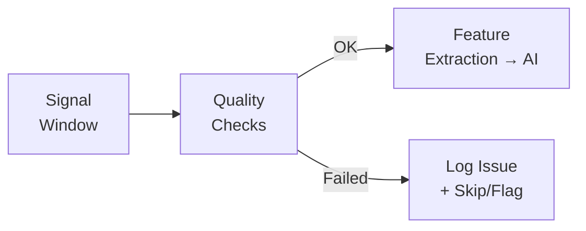

# Signal Quality Checks

## Purpose

Signal quality checks identify data that may be unreliable due to hardware issues, environmental conditions, or processing artefacts. Flagging low-quality data prevents it from corrupting the AI model's baseline or triggering false alarms.

## Quality Checks

### 1. Saturation Check
**What:** ADC output at its maximum or minimum value for extended periods.
**Cause:** Signal amplitude exceeds the ADC's input range (clipping).
**Action:** Flag affected samples as saturated; do not use for AI training.

### 2. Data Gap Detection
**What:** Missing samples or unexpected time gaps between consecutive timestamps.
**Cause:** Communication error, buffer overflow, DAQ restart.
**Action:** Log the gap; do not interpolate across large gaps.

### 3. DC Level Check
**What:** Mean signal level deviates significantly from the expected baseline.
**Cause:** Sensor failure, capillary clogging, temperature extreme, reference chamber leak.
**Action:** Flag for investigation; possible sensor maintenance needed.

### 4. Noise Level Check
**What:** RMS noise level significantly higher or lower than the established baseline.
**Cause:** High wind, electronic interference, sensor degradation, or sensor disconnection.
**Action:** Flag windows with abnormally high or low noise.

### 5. Spectral Anomaly Check
**What:** Persistent strong peak at a specific frequency not present in the baseline.
**Cause:** Electronic interference (e.g., mains hum at 50/60 Hz), mechanical vibration.
**Action:** Investigate; may need hardware mitigation.

### 6. Temperature Range Check
**What:** Temperature outside the expected operating range.
**Cause:** Extreme weather, enclosure failure, direct sunlight.
**Action:** Flag data as potentially temperature-affected.

## Quality Status Codes

| Code | Meaning | AI Training | AI Inference |
|---|---|---|---|
| `OK` | Data passes all quality checks | Include | Process normally |
| `SATURATED` | ADC clipping detected | Exclude | Flag result |
| `GAP` | Data gap in this window | Exclude | Skip window |
| `HIGH_NOISE` | Noise level above threshold | Exclude | Process with caution |
| `DRIFT` | DC level drift detected | Exclude | Process with caution |
| `TEMP_WARNING` | Temperature outside range | Include with caution | Process with flag |
| `SENSOR_ERROR` | Sensor communication failure | Exclude | No data |

## Implementation

Quality checks run automatically after each signal window is processed and before features are passed to the AI model:

---

*See also: [Signal Processing Overview](signal-processing-overview.md) | [Feature Extraction](feature-extraction.md) | [Noise Reduction](noise-reduction.md)*
