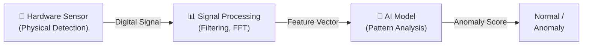
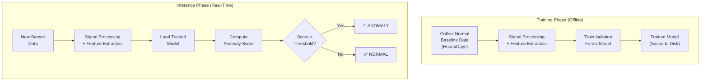

# AI Overview

## The Role of AI in InfraSocket

> **Critical Clarification:**
> The AI does not physically detect pressure waves. The hardware sensor detects pressure waves. The AI analyzes the **digitized, processed signal data** to identify patterns that deviate from the learned baseline of normal atmospheric conditions.

## What AI Does in This System

| AI Function | Description |
|---|---|
| **Learn baseline** | Build a model of what "normal" atmospheric conditions look like in terms of signal features |
| **Score new data** | Assign an anomaly score to each new signal window based on how different it is from the learned baseline |
| **Flag anomalies** | When the score exceeds a threshold, flag the data as anomalous |

## What AI Does NOT Do in This System

| Non-Function | Explanation |
|---|---|
| Physically sense pressure | The hardware sensor does this |
| Classify event types | The MVP does not identify what caused an anomaly |
| Replace signal processing | FFT and filtering are deterministic math, not AI |
| Guarantee detection | The AI can miss events or produce false alarms |
| Work without data | The model must be trained on baseline data first |

## MVP Approach: Unsupervised Anomaly Detection

For the MVP, the AI component uses **unsupervised anomaly detection** because:

1. **No labeled dataset exists** for the prototype's specific sensor in its specific environment
2. **Anomalies are rare** and unpredictable — we cannot collect examples of all possible anomalies
3. **The system should work immediately** after a baseline collection period, without manual labeling

### Chosen Algorithm: Isolation Forest

Isolation Forest is an unsupervised anomaly detection algorithm well-suited for this application.

> See [Anomaly Detection](anomaly-detection.md) and [Model Selection](model-selection.md) for detailed documentation.

## AI Pipeline

## Relationship Between Signal Processing and AI

| Stage | Type | Deterministic? | Output |
|---|---|---|---|
| Filtering | Signal Processing | Yes | Filtered signal |
| FFT | Signal Processing | Yes | Frequency spectrum |
| Feature Extraction | Signal Processing | Yes | Feature vector |
| Isolation Forest | **AI / Machine Learning** | No (learned model) | Anomaly score |
| Threshold comparison | Decision logic | Yes | Normal / Anomaly |

Only the Isolation Forest step is AI/ML. Everything before it is traditional signal processing.

## Future AI Development

| Phase | Capability | Requirement |
|---|---|---|
| **MVP** | Normal vs. Anomaly | Normal baseline data only |
| **Phase 2** | Improved anomaly detection (multiple models) | More baseline data, parameter tuning |
| **Phase 3** (`Future Scope`) | Event classification (storm-like, explosion-like, etc.) | Large labeled dataset |
| **Phase 4** (`Future Scope`) | Deep learning on spectrograms | GPU computing, large diverse dataset |

---

*See also: [Anomaly Detection](anomaly-detection.md) | [Model Selection](model-selection.md) | [Dataset Strategy](dataset-strategy.md)*
