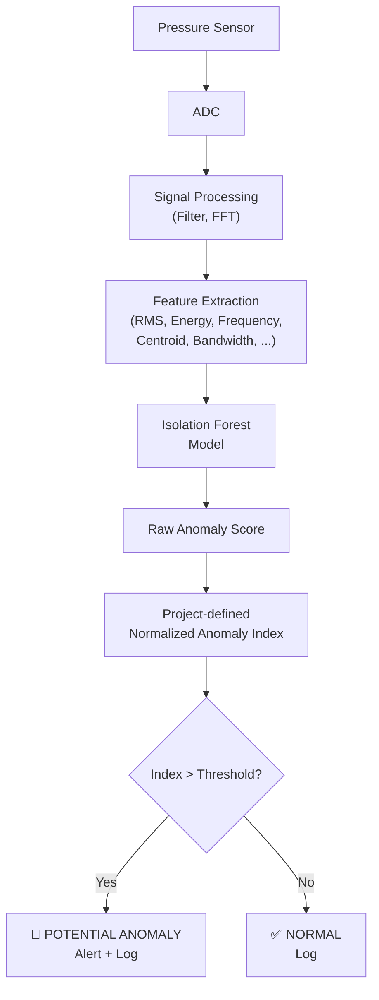

# Anomaly Detection

## Definition

> **An anomaly is a signal pattern that significantly differs from the learned normal behaviour.**

The system does not define what specific events constitute anomalies. Instead, it learns what "normal" looks like and flags anything that deviates significantly. This approach is robust because it does not require prior knowledge of what anomalies look like — only knowledge of what normal looks like.

## How Isolation Forest Works

> **Simple Explanation:**
> Imagine you have a bag of mostly red marbles (normal data) and occasionally a blue marble (anomaly). If you randomly pick properties to sort by (size, weight, colour), the blue marble will be isolated from the group much faster than any individual red marble. Isolation Forest works the same way — it randomly partitions the data and measures how quickly each data point becomes isolated. Anomalies are isolated faster because they are "few and different."

> **Technical Explanation:**
> Isolation Forest constructs an ensemble of binary decision trees (Isolation Trees). Each tree recursively partitions the data by randomly selecting a feature and a random split value within the feature's range.
>
> - **Normal points** are similar to many other points, so they require many splits (deep tree paths) to become isolated.
> - **Anomalous points** are few and different, so they require fewer splits (shorter tree paths) to become isolated.
>
> The **anomaly score** is derived from the average path length across all trees. Shorter average paths indicate higher anomaly scores.

## Isolation Forest for InfraSocket

### Architecture

### Training Process

1. **Collect baseline data:** Record sensor data during normal atmospheric conditions for an extended period (hours to days)
2. **Process data:** Apply the full signal-processing pipeline to the baseline data
3. **Extract features:** Compute feature vectors for each analysis window
4. **Quality filter:** Remove windows with quality issues (saturation, gaps, excessive noise)
5. **Train model:** Fit the Isolation Forest on the clean feature vectors
6. **Save model:** Serialize the trained model to disk for inference

### Inference Process

1. **Receive new data:** Signal window arrives from real-time processing
2. **Extract features:** Same feature extraction as training
3. **Normalize features:** Apply the same normalization used during training, if feature scaling is used (see note below)
4. **Predict:** Pass the feature vector through the trained Isolation Forest
5. **Score:** Receive the raw anomaly score; apply project-defined normalization to produce the anomaly index
6. **Compare:** Compare the normalized anomaly index to the threshold
7. **Act:** Log the result; if anomalous, trigger alert

### Model Parameters

| Parameter | Description | Recommended Starting Value |
|---|---|---|
| `n_estimators` | Number of trees in the forest | 100–200 |
| `max_samples` | Number of samples used to build each tree | 256 or "auto" |
| `contamination` | Expected proportion of anomalies in training data | 0.01–0.05 (or "auto") |
| `max_features` | Number of features used per tree | 1.0 (all features) |
| `random_state` | Seed for reproducibility | Fixed integer (e.g., 42) |

`Assumption`: These are starting values. Optimal parameters will be determined through testing and validation.

## Anomaly Index Interpretation

The raw Isolation Forest score is processed through a project-defined normalization to produce a normalized anomaly index. This index is used for visualization and threshold-based decision making.

| Index Range | Interpretation | Action |
|---|---|---|
| Low | Clearly normal | No action |
| Below threshold | Likely normal | No action (log for analysis) |
| Near threshold | Uncertain / borderline | Log with attention flag |
| Above threshold | Potential anomaly | Trigger alert |
| High | Strong potential anomaly | Trigger high-priority alert |

> **Important:** The normalized anomaly index is a project-defined visualization/decision-support score. It is NOT a probability and must not be interpreted as model confidence. Actual index distributions and appropriate thresholds will be determined by testing with real data. See [Threshold Selection](threshold-selection.md).

## Why Isolation Forest Is Suitable for This Application

| Reason | Explanation |
|---|---|
| **Unsupervised** | Does not require labeled anomaly examples |
| **Works without large labeled datasets** | The anomaly detector can be trained without requiring labelled anomaly examples, but the amount and diversity of normal baseline data required for reliable performance will be determined experimentally |
| **Computationally lightweight** | Fast training and inference; suitability for specific edge hardware to be benchmarked |
| **No distribution assumptions** | Does not assume data follows a specific distribution |
| **Interpretable** | Anomaly score has an intuitive meaning |
| **Well-established** | Published in IEEE ICDM 2008, widely used and validated |

## Limitations of Anomaly Detection

1. **Anomaly ≠ event identification:** A detected anomaly could be caused by a distant explosion, a weather front, sensor malfunction, or an animal bumping the sensor. The model does not know the cause.

2. **Baseline dependency:** The model's definition of "normal" is limited to the conditions present during training. Seasonal changes, new environmental factors, or sensor degradation may require retraining.

3. **False positives:** Environmental changes that differ from the training baseline (e.g., a nearby construction project starting) may be flagged as anomalies even though they are not infrasound events of interest.

4. **False negatives:** Anomalous events that happen to produce feature vectors similar to normal conditions may be missed.

5. **No severity estimation:** The anomaly score indicates how different a signal is, not how "important" or "dangerous" it is.

---

*See also: [AI Overview](ai-overview.md) | [Model Selection](model-selection.md) | [Threshold Selection](threshold-selection.md) | [False Positive Handling](false-positive-handling.md)*
