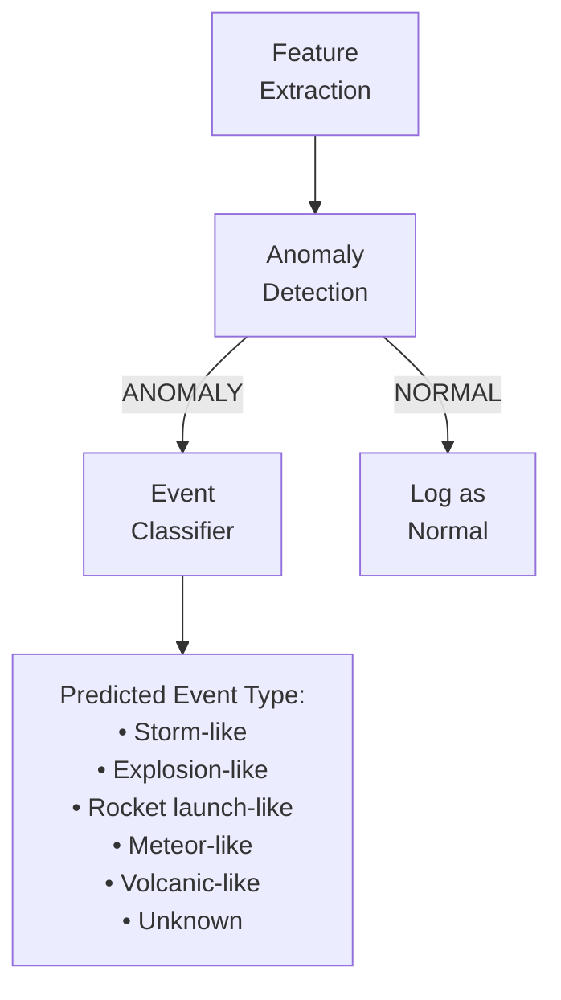

# Future Event Classification

> **This section describes `Future Scope` capabilities that are NOT part of the MVP.**

## The Distinction

```
Anomaly Detection (MVP):     Is this signal UNUSUAL?      → Yes / No
Event Classification (Future): WHAT TYPE of unusual event? → Storm / Explosion / Meteor / Unknown
```

These are fundamentally different problems:
- **Anomaly detection** requires only normal baseline data (unsupervised)
- **Event classification** requires labeled examples of each event type (supervised)

## Why Classification Is Not in the MVP

1. **No labeled dataset:** The prototype does not have labeled examples of different infrasound event types
2. **Sensor-specific:** Classification models trained on other sensors/locations may not transfer
3. **Complexity:** Supervised classification requires data collection, labeling, model design, and extensive validation
4. **Validation difficulty:** Without ground truth, classification accuracy cannot be verified

## Future Classification Architecture



## Potential Future Event Classes

| Class | Typical Spectral Characteristics | Data Source Needed |
|---|---|---|
| Storm-like | Broadband, sustained, variable | Weather-correlated recordings |
| Explosion-like | Impulsive, broadband, short duration | Controlled blasts or public datasets |
| Rocket launch-like | Strong, sustained, specific frequency profile | Launch monitoring datasets |
| Meteor-like | Impulsive, broadband, often with dispersive characteristics | Fireball databases, CTBTO data |
| Volcanic-like | Sustained, tremor-like, specific frequency bands | Volcano monitoring stations |
| Unknown | Does not match other classes | Catch-all category |

> **Important note on naming:** These class names use "-like" terminology intentionally. The system would classify signals as "explosion-like," not confirm that an explosion occurred. Confirmation requires additional evidence.

## Requirements for Future Classification

| Requirement | Description |
|---|---|
| Labeled dataset | Hundreds to thousands of labeled examples per class |
| Diverse conditions | Data from multiple sensors, locations, and conditions |
| Supervised model | CNN on spectrograms, or gradient-boosted trees on features |
| Evaluation framework | Per-class precision, recall, confusion matrix |
| Expert validation | Domain expert review of classification results |

## Recommended Approach (When Ready)

1. Start by classifying only 2–3 clearly distinct classes
2. Always include an "Unknown" class for signals that don't match any learned pattern
3. Use a confidence threshold — only report a class if confidence exceeds a threshold; otherwise report "Unknown"
4. Never report a classification as fact — always indicate it is a model prediction

---

*See also: [AI Overview](ai-overview.md) | [Anomaly Detection](anomaly-detection.md) | [Future Scope](../16-roadmap/future-scope.md)*
