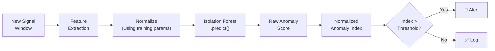

# Model Inference

## Inference Pipeline

Model inference is the process of using the trained Isolation Forest model to score new, unseen data in real-time.

## Inference Steps

1. **Feature extraction:** Compute the same features as during training, in the same order
2. **Normalization:** If feature scaling is applied, use the saved parameters from training (NOT recomputed). Feature scaling/normalization will be evaluated during experimentation. If applied, the transformation fitted on training data must be reused unchanged during inference.
3. **Model prediction:** Call `model.decision_function()` or `model.score_samples()` to get the raw normalized anomaly index
4. **Project-defined normalization:** Transform the raw score into the normalized anomaly index
5. **Threshold comparison:** Compare the normalized anomaly index against the configured threshold
6. **Action:** Log result; if anomalous, trigger alert

## Performance Targets

> **Performance targets will be benchmarked on the selected edge hardware after implementation.**

| Metric                     | Current Status  |
| -------------------------- | --------------- |
| AI inference latency       | To Be Validated |
| Feature extraction latency | To Be Validated |
| Memory usage               | To Be Validated |
| CPU utilization            | To Be Validated |
| Power consumption          | To Be Validated |

## Failure Handling

| Failure | Handling |
|---|---|
| Model file missing | Log error; continue recording data without AI scoring |
| Feature extraction error | Skip window; log error |
| Model prediction error | Log error; continue with next window |
| Score is NaN / invalid | Treat as unknown; do not trigger alert or log as normal |

**Key principle:** If the AI model fails, the system continues recording sensor data. AI failure should never cause data loss.

---

*See also: [Model Training](model-training.md) | [Threshold Selection](threshold-selection.md) | [Anomaly Detection](anomaly-detection.md)*
