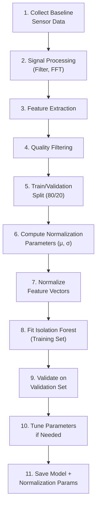

# Model Training

## Training Data Requirements

| Requirement | Specification |
|---|---|
| Data source | Level 1 baseline (normal atmospheric conditions) |
| Minimum duration | 12+ hours of continuous, quality-checked data |
| Recommended duration | 24–72 hours (captures diurnal variation) |
| Quality | Only windows passing all quality checks |
| Conditions | Representative of expected deployment conditions |

## Training Workflow



## Training Parameters

```python
# Proposed Isolation Forest configuration
from sklearn.ensemble import IsolationForest

model = IsolationForest(
    n_estimators=100,       # Number of trees
    max_samples='auto',     # Samples per tree (auto = min(256, n_samples))
    contamination=0.02,     # Expected fraction of anomalies in training data
    max_features=1.0,       # Use all features
    random_state=42,        # Reproducibility
    n_jobs=-1               # Use all CPU cores
)

model.fit(X_train_normalized)
```

`Assumption`: These are starting parameters. Tuning may be needed based on validation results.

## Artifacts to Save

After training, save:

1. **The trained model** (e.g., using `joblib` or `pickle`)
2. **Normalization parameters** (mean and standard deviation for each feature)
3. **Feature list** (ordered list of feature names, to ensure correct alignment)
4. **Training metadata** (date, dataset size, parameters, quality check summary)

## Retraining Schedule

| Trigger | Action |
|---|---|
| Initial deployment | Train on first baseline collection |
| Seasonal change | Consider retraining with new baseline |
| Hardware change | Retrain required (new sensor characteristics) |
| High false positive rate | Investigate and potentially retrain with more data |
| Deployment site change | Retrain required (new ambient environment) |

## Training Validation

After training, validate the model by:

1. **Score the validation set** — check that normal validation data receives low anomaly scores
2. **Score known test anomalies** (Level 2 data) — check that controlled anomalies receive high scores
3. **Plot score distribution** — normal data should cluster at low scores; anomalies should be clearly separated

---

*See also: [Dataset Strategy](dataset-strategy.md) | [Model Inference](model-inference.md) | [Model Evaluation](model-evaluation.md)*
