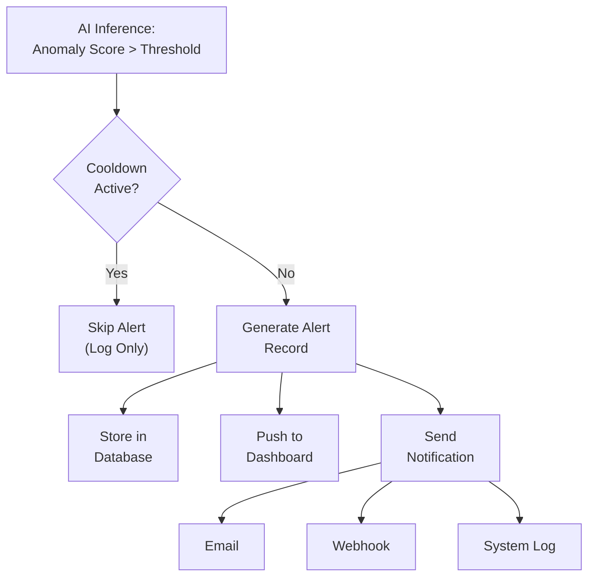

# Alert System

## Purpose

The alert system notifies users when the AI anomaly detection identifies an unusual signal pattern.

## Alert Flow



## Alert Record

```json
{
  "alert_id": "ALERT-20250315-104530",
  "timestamp": "2025-03-15T10:45:30Z",
  "sensor_id": "SENSOR-001",
  "anomaly_score": 0.82,
  "threshold": 0.70,
  "severity": "HIGH",
  "status": "NEW",
  "window_id": "WIN-20250315-104500",
  "acknowledged": false
}
```

## Severity Levels

| Severity | Score Range | Action |
|---|---|---|
| LOW | 0.70–0.80 | Dashboard notification |
| MEDIUM | 0.80–0.90 | Dashboard + log emphasis |
| HIGH | 0.90–1.00 | Dashboard + external notification |

`Assumption`: Severity ranges are configurable and will be calibrated based on experience.

## Alert Configuration

```yaml
alerts:
  enabled: true
  threshold: 0.70
  cooldown_seconds: 300
  confirmation_windows: 1
  channels:
    dashboard: true
    email: false        # Enable when SMTP is configured
    webhook: false      # Enable when webhook URL is set
```

## Alert Lifecycle

1. **NEW** — Alert generated, displayed on dashboard
2. **ACKNOWLEDGED** — User has seen the alert
3. **REVIEWED** — User has investigated and marked as true positive, false positive, or unknown
4. **ARCHIVED** — Alert moved to historical archive

---

*See also: [Dashboard](dashboard.md) | [Anomaly Detection](../05-ai-ml/anomaly-detection.md) | [False Positive Handling](../05-ai-ml/false-positive-handling.md)*
