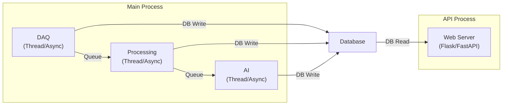

# Backend

## Responsibilities

The backend is the central software component that orchestrates all services: data acquisition, processing, AI inference, storage, and API serving.

## Architecture Pattern

For the MVP prototype, a **monolithic architecture** is recommended:
- All services run in a single process or a small set of coordinated processes
- Simpler to develop, deploy, and debug
- Adequate for single-station operation

`Future Scope`: Microservice architecture for multi-station deployment.

## Core Modules

### 1. DAQ Module
Reads raw samples from the ADC hardware (via serial/USB/SPI). Buffers samples and distributes to storage and processing.

### 2. Processing Module
Applies the signal-processing pipeline (DC removal, filtering, windowing, FFT, feature extraction) to each analysis window.

### 3. AI Module
Loads the trained Isolation Forest model, normalizes features, computes anomaly scores, and makes threshold decisions.

### 4. Storage Module
Writes data to the database (raw measurements, processed features, anomaly records). Handles write buffering and error recovery.

### 5. API Module
Serves REST endpoints for the dashboard and external consumers. Returns JSON responses.

### 6. Alert Module
Monitors anomaly decisions and triggers notifications (dashboard alerts, email, webhook).

## Process Model

---

*See also: [Software Overview](software-overview.md) | [Data Ingestion](data-ingestion.md) | [Real-Time Processing](realtime-processing.md)*
