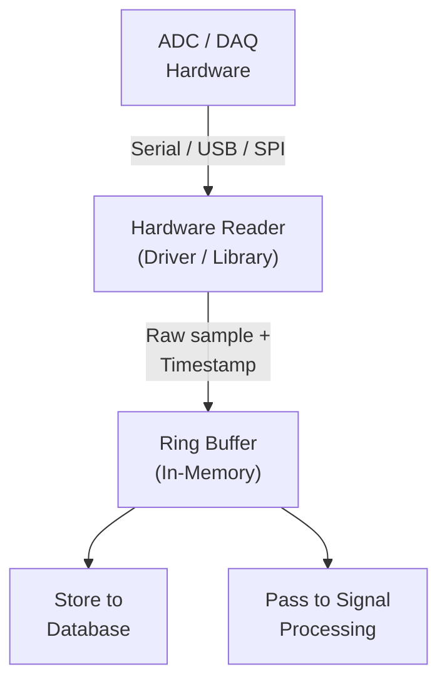

# Data Ingestion

## Overview

Data ingestion is the process of reading raw digital samples from the ADC/DAQ hardware and making them available to the software pipeline.

## Ingestion Flow



## Ingestion Requirements

| Requirement | Description |
|---|---|
| Continuous reading | Must read every sample without dropping |
| Timestamping | Each sample gets a precise timestamp |
| Buffering | In-memory buffer handles processing speed variations |
| Error handling | Communication errors are logged; recovery is automatic |
| Data preservation | Raw data is written to database before any processing |

## Communication Protocols

| Protocol | Usage | Notes |
|---|---|---|
| Serial (UART) | Microcontroller-based DAQ | Common, simple, well-supported |
| USB | USB-connected DAQ boards | Higher bandwidth, plug-and-play |
| SPI / I²C | Direct hardware interface | When running on SBC with GPIO access |
| TCP/IP | Networked DAQ | For remote sensor placement |

## Data Format (Ingested)

Each ingested sample is a record containing:

```json
{
  "timestamp": "2025-03-15T10:30:00.020Z",
  "adc_value": 32847,
  "channel": 0,
  "temperature_raw": 2456
}
```

---

*See also: [Backend](backend.md) | [Raw Data Format](../07-data/raw-data-format.md) | [Database](database.md)*
