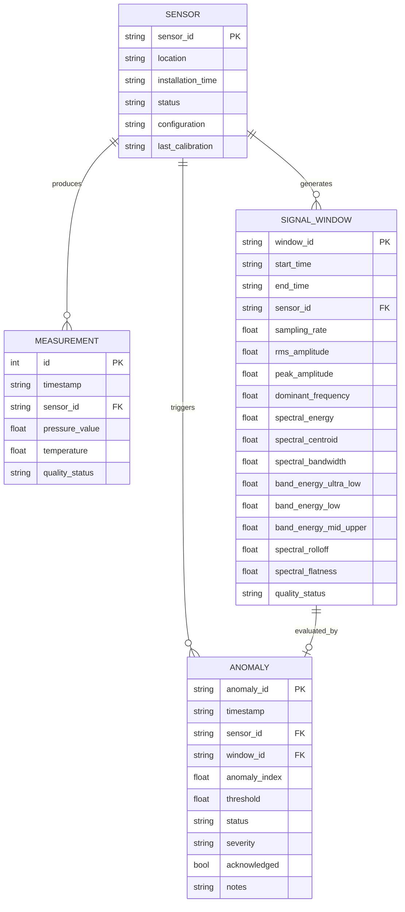

# Data Model

## Entity-Relationship Diagram

## Entity Descriptions

### Sensor
Metadata about each physical sensor installation.

### Measurement
Individual raw pressure samples with timestamps. This is the highest-volume table.

### Signal Window
Processed signal analysis windows with extracted features. One window typically contains 30–60 seconds of measurements.

### Anomaly
Results of AI anomaly detection for each signal window. Contains the normalized anomaly index, threshold used, and classification decision.

## Relationships

| Relationship | Cardinality | Description |
|---|---|---|
| Sensor → Measurement | One-to-Many | Each sensor produces many measurements |
| Sensor → Signal Window | One-to-Many | Each sensor generates many analysis windows |
| Signal Window → Anomaly | One-to-One | Each window produces one anomaly evaluation |
| Sensor → Anomaly | One-to-Many | Each sensor can have many anomaly records |

---

*See also: [Raw Data Format](raw-data-format.md) | [Database](../06-software/database.md) | [API Design](../06-software/api-design.md)*
