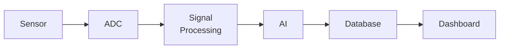

# Integration Testing

## End-to-End Integration Test

**Objective:** Verify that the complete pipeline works from sensor input to dashboard output.

### INT-01: Complete Pipeline
**Procedure:**
1. Power on the system
2. Verify sensor readings appear in the raw data store
3. Verify signal processing produces filtered data and features
4. Verify AI produces anomaly scores
5. Verify data appears on the dashboard
6. Apply a controlled test signal
7. Verify the dashboard shows the signal in the waveform
8. Verify the FFT shows the correct frequency peak
9. Verify the AI flags the signal as an anomaly
10. Verify an alert appears on the dashboard

**Pass criteria:** All 10 steps complete successfully.

### INT-02: Data Persistence
**Procedure:** Run system for 1 hour; restart; verify all data is preserved in database.
**Pass criteria:** No data loss after restart.

### INT-03: API Data Consistency
**Procedure:** Query API endpoints; verify returned data matches database contents.
**Pass criteria:** API responses match stored data.

## Results Template

| Test ID | Date | Result | Notes |
|---|---|---|---|
| INT-01 | ___ | _Pass/Fail_ | |
| INT-02 | ___ | _Pass/Fail_ | |
| INT-03 | ___ | _Pass/Fail_ | |

---

*See also: [Testing Strategy](testing-strategy.md) | [Performance Testing](performance-testing.md)*
