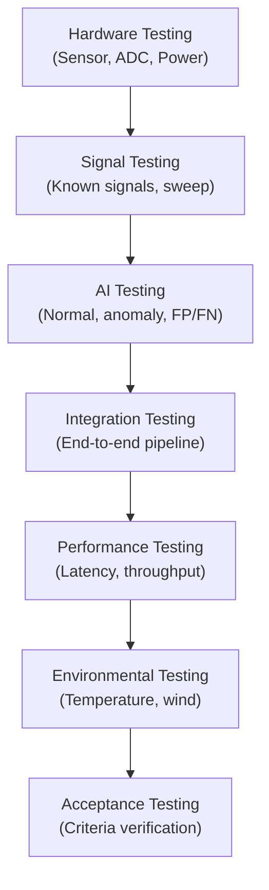

# Testing Strategy

## Testing Layers

## Test Categories

| Category | What Is Tested | Key Questions |
|---|---|---|
| [Hardware](hardware-testing.md) | Physical components | Does the sensor respond? Does the ADC digitize correctly? |
| [Sensor](sensor-testing.md) | Sensor-specific behaviour | Sensitivity, linearity, noise floor? |
| [Signal](signal-testing.md) | Signal processing pipeline | Correct filtering? Correct FFT? |
| [AI](ai-testing.md) | Anomaly detection model | Detects controlled anomalies? False positive rate? |
| [Integration](integration-testing.md) | Complete pipeline | Data flows correctly from sensor to dashboard? |
| [Performance](performance-testing.md) | Speed and resource usage | Meets latency and memory targets? |
| [Environmental](environmental-testing.md) | Real-world conditions | Handles temperature changes? Wind? |
| [Acceptance](acceptance-criteria.md) | Pass/fail criteria | System meets documented requirements? |

## Test Environment

| Environment | Purpose |
|---|---|
| Lab bench | Component-level testing, controlled conditions |
| Quiet indoor room | Baseline noise characterization |
| Outdoor (sheltered) | Realistic but moderate conditions |
| Outdoor (exposed) | Stress testing, wind exposure |

---

*See also: [Hardware Testing](hardware-testing.md) | [Acceptance Criteria](acceptance-criteria.md)*
