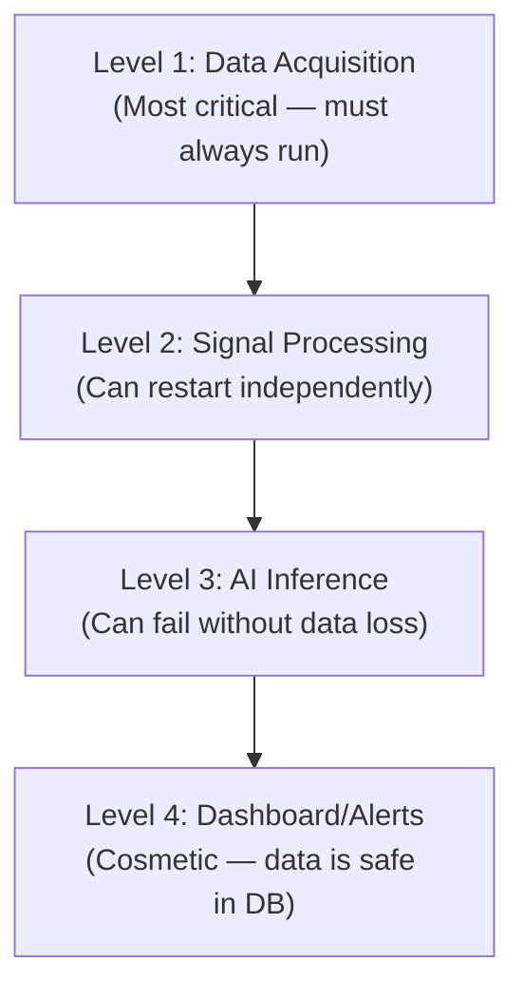

# Reliability

## Design for Reliability

### Principle: Graceful Degradation

The system is designed so that failures in higher-level components do not prevent lower-level components from operating:

| If This Fails... | Data Acquisition | Signal Processing | AI | Dashboard |
|---|---|---|---|---|
| Dashboard | ✅ Continues | ✅ Continues | ✅ Continues | ❌ Unavailable |
| AI inference | ✅ Continues | ✅ Continues | ❌ No scoring | ✅ Shows data (no AI) |
| Signal processing | ✅ Continues | ❌ No features | ❌ No scoring | ⚠️ Raw data only |
| Data acquisition | ❌ No data | ❌ No data | ❌ No data | ❌ Stale data |

### Watchdog and Auto-Restart
Software services should be configured to auto-restart on failure (e.g., using systemd on Linux).

### Heartbeat Logging
Each service logs periodic heartbeat messages. If heartbeats stop, the health monitor raises an alert.

---

*See also: [Security](security.md) | [Fault Handling](fault-handling.md)*
