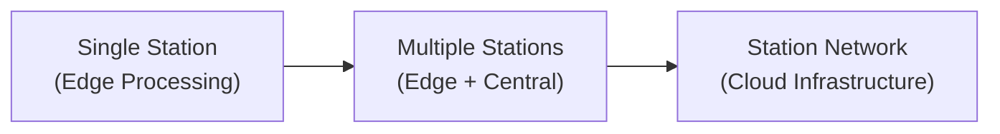

# Scalability

## Scaling Dimensions

| Dimension | Current (MVP) | Scaled (`Future Scope`) |
|---|---|---|
| Sensors | 1 | Multiple (5–50+) |
| Processing | Single edge computer | Central server + edge nodes |
| Storage | Local SQLite | PostgreSQL or time-series DB |
| Dashboard | Single station view | Multi-station map view |
| AI | Single Isolation Forest | Ensemble models, deep learning |
| Network | Local | Distributed, internet-connected |

## Scaling Challenges

1. **Data volume:** Multiple sensors at 50 Hz each generate significant data
2. **Synchronization:** Array processing requires tightly synchronized clocks
3. **Networking:** Remote sensors need reliable connectivity
4. **Model management:** Different sites may need different baselines
5. **Infrastructure:** Central server, database, and networking add complexity and cost

## Scaling Approach

Each scaling step adds capability but also complexity and cost.

---

*See also: [Cost Optimization](cost-optimization.md) | [Future Scope](../16-roadmap/future-scope.md)*
