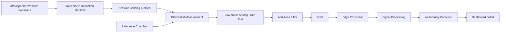
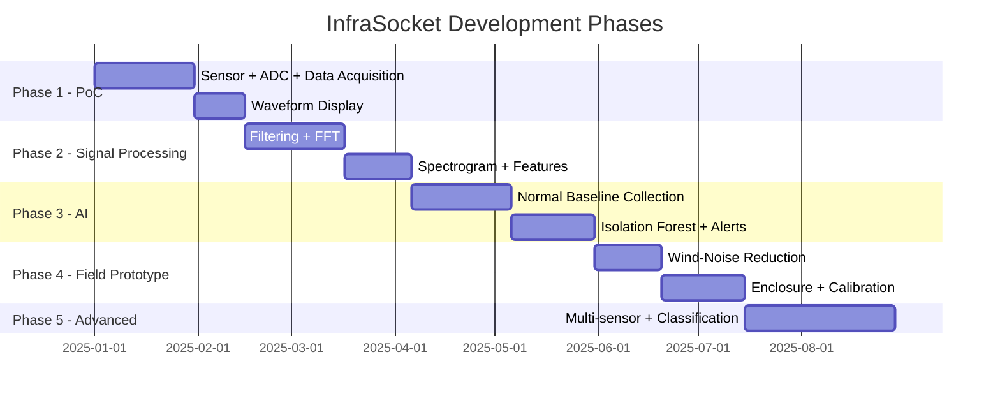

# InfraSocket — A Low-Cost AI-Assisted Infrasound Monitoring and Anomaly Detection Platform

> **Connecting the Unheard.**

> InfraSocket is a low-cost, portable and modular infrasound monitoring platform that combines pressure sensing, signal processing and AI-assisted anomaly screening for local and experimental monitoring. It is designed as a complementary sensing layer rather than a replacement for established professional monitoring networks.

---

## The Problem

Very-low-frequency atmospheric pressure waves — called **infrasound** — are generated by natural and human-made events such as volcanic eruptions, severe storms, large explosions, meteor entries, and rocket launches. These pressure waves travel vast distances through the atmosphere but oscillate far too slowly for normal microphones or human ears to detect.

Monitoring infrasound requires specialized hardware, careful noise reduction (especially against wind), precision digitization, and intelligent analysis. Existing high-end systems used by organizations like the CTBTO (Comprehensive Nuclear-Test-Ban Treaty Organization) are technically complex and can be expensive, making infrasound monitoring largely inaccessible for educational, research, and small-scale applications.

## The Solution

**InfraSocket** is a prototype system designed to make infrasound monitoring more accessible. It combines:

- A **pressure-sensing subsystem** with a differential-pressure design and reference chamber
- A **wind-noise reduction** manifold using spatial averaging
- A **low-noise analog front end** and high-resolution ADC for digitization
- **Digital signal processing** including filtering, FFT, and spectral analysis
- **AI-based anomaly detection** (using Isolation Forest) to flag unusual signal patterns
- A **real-time dashboard** for visualization and alerting

> **Important:** The AI component analyzes digitized sensor data — it does not physically detect pressure waves. The sensor hardware performs the physical detection; the AI identifies unusual patterns in the processed digital signal.

## Key Features

| Feature | Description |
|---|---|
| Low-frequency detection | Target range: 0.01–20 Hz |
| Wind-noise reduction | Spatial-averaging manifold with multiple inlets |
| Differential pressure | Reference chamber suppresses slow atmospheric drift |
| Digital signal processing | Filtering, FFT, spectrogram, feature extraction |
| AI anomaly detection | Isolation Forest for unsupervised anomaly flagging |
| Real-time dashboard | Live waveform, spectrum, normalized anomaly index, alerts |
| Modular design | Hardware and software components are independently upgradeable |

## System Architecture (Overview)

## AI Role

The AI component in InfraSocket is focused on **anomaly detection** — not event classification. AI identifies deviations from learned signal/environmental baselines. Determining the physical cause of an anomaly requires additional analysis and potentially additional data sources.

| Aspect | Current MVP | Future Scope |
|---|---|---|
| **Approach** | Unsupervised anomaly detection | Supervised event classification |
| **Model** | Isolation Forest | Deep learning, CNNs on spectrograms |
| **Output** | Normal vs. Anomaly | Event type (storm-like, explosion-like, etc.) |
| **Data requirement** | Normal baseline data | Large labeled dataset |

## Complete Tech Stack

| Layer             | Technology / Candidate                 | Purpose                       | Status              |
| ----------------- | -------------------------------------- | ----------------------------- | ------------------- |
| Sensor            | MEMS/differential pressure sensor      | Pressure measurement          | Prototype candidate |
| ADC               | External/high-resolution ADC           | Digitization                  | To validate         |
| Edge Computer     | Raspberry Pi / Linux SBC (primary)     | Signal processing + AI + API  | Prototype candidate |
| MCU (optional)    | ESP32 (optional acquisition/comms)     | ADC interface / LoRa comms    | Optional            |
| Signal Processing | Python + NumPy + SciPy                 | Filtering/FFT/features        | Proposed            |
| AI                | Isolation Forest                       | Anomaly screening             | MVP                 |
| Backend           | FastAPI                                | API/realtime processing       | Proposed            |
| Realtime          | WebSocket                              | Live telemetry                | Proposed            |
| Database          | SQLite/PostgreSQL                      | Data storage                  | Prototype/scalable  |
| Frontend          | React + TypeScript                     | Dashboard                     | Proposed            |
| UI                | Tailwind CSS                           | Interface                     | Proposed            |
| Visualization     | Time-series/spectrogram charts         | Signal visualization          | Proposed            |
| Communication     | Wi-Fi / Ethernet / 4G / LoRa candidate | Telemetry                     | To validate         |
| Deployment        | Raspberry Pi/Laptop/Cloud              | Runtime                       | Prototype/Future    |

## Measured vs Target

| Parameter           | Target / Candidate                      | Status               |
| ------------------- | --------------------------------------- | -------------------- |
| Frequency response  | Approximately 0.01–20 Hz                | To Be Validated      |
| Sampling rate       | ≥50 Hz candidate; higher rate preferred | To Be Validated      |
| Noise floor         | TBD                                     | Not Measured         |
| Sensitivity         | TBD                                     | Calibration Required |
| Wind attenuation    | TBD                                     | Experimental         |
| AI performance      | TBD                                     | Dataset Dependent    |
| False-positive rate | TBD                                     | Validation Required  |
| Power consumption   | TBD                                     | Hardware Dependent   |

## Menu Navigation

### 📋 Project Overview
- [Problem Statement](01-overview/problem-statement.md)
- [Project Objectives](01-overview/project-objectives.md)
- [Proposed Solution](01-overview/proposed-solution.md)
- [Real-World Use Cases](01-overview/real-world-use-cases.md)
- [Key Features](01-overview/key-features.md)
- [Scope and Limitations](01-overview/scope-and-limitations.md)

### 🏗️ System Architecture
- [System Overview](02-system-architecture/system-overview.md)
- [Architecture](02-system-architecture/architecture.md)
- [Hardware Architecture](02-system-architecture/hardware-architecture.md)
- [Software Architecture](02-system-architecture/software-architecture.md)
- [Data Flow](02-system-architecture/data-flow.md)
- [Component Interaction](02-system-architecture/component-interaction.md)
- [Deployment Architecture](02-system-architecture/deployment-architecture.md)

### 🔧 Hardware
- [Hardware Overview](03-hardware/hardware-overview.md)
- [Pressure Sensing](03-hardware/pressure-sensing.md)
- [Diaphragm Design](03-hardware/diaphragm-design.md)
- [Differential Pressure System](03-hardware/differential-pressure-system.md)
- [Reference Chamber](03-hardware/reference-chamber.md)
- [Wind-Noise Reduction](03-hardware/wind-noise-reduction.md)
- [Analog Front End](03-hardware/analog-front-end.md)
- [ADC / Digitization](03-hardware/adc-digitization.md)
- [Temperature Sensing](03-hardware/temperature-sensing.md)
- [Environmental Enclosure](03-hardware/environmental-enclosure.md)
- [Power System](03-hardware/power-system.md)
- [Calibration](03-hardware/calibration.md)
- [Hardware BOM](03-hardware/hardware-bom.md)

### 📊 Signal Processing
- [Signal Processing Overview](04-signal-processing/signal-processing-overview.md)
- [Sampling](04-signal-processing/sampling.md)
- [Filtering](04-signal-processing/filtering.md)
- [FFT Analysis](04-signal-processing/fft-analysis.md)
- [Frequency Analysis](04-signal-processing/frequency-analysis.md)
- [Noise Reduction](04-signal-processing/noise-reduction.md)
- [Feature Extraction](04-signal-processing/feature-extraction.md)
- [Signal Quality Checks](04-signal-processing/signal-quality-checks.md)

### 🤖 AI / ML
- [AI Overview](05-ai-ml/ai-overview.md)
- [Anomaly Detection](05-ai-ml/anomaly-detection.md)
- [Dataset Strategy](05-ai-ml/dataset-strategy.md)
- [Data Preprocessing](05-ai-ml/data-preprocessing.md)
- [Feature Engineering](05-ai-ml/feature-engineering.md)
- [Model Selection](05-ai-ml/model-selection.md)
- [Model Training](05-ai-ml/model-training.md)
- [Model Inference](05-ai-ml/model-inference.md)
- [Threshold Selection](05-ai-ml/threshold-selection.md)
- [Model Evaluation](05-ai-ml/model-evaluation.md)
- [False Positive Handling](05-ai-ml/false-positive-handling.md)
- [Future Event Classification](05-ai-ml/future-event-classification.md)

### 💻 Software
- [Software Overview](06-software/software-overview.md)
- [Backend](06-software/backend.md)
- [Data Ingestion](06-software/data-ingestion.md)
- [API Design](06-software/api-design.md)
- [Real-Time Processing](06-software/realtime-processing.md)
- [Database](06-software/database.md)
- [Dashboard](06-software/dashboard.md)
- [Alert System](06-software/alert-system.md)

### 📦 Data
- [Data Model](07-data/data-model.md)
- [Raw Data Format](07-data/raw-data-format.md)
- [Processed Data Format](07-data/processed-data-format.md)
- [Feature Data Format](07-data/feature-data-format.md)
- [Anomaly Record Format](07-data/anomaly-record-format.md)
- [Data Retention](07-data/data-retention.md)

### 🧪 Testing
- [Testing Strategy](08-testing/testing-strategy.md)
- [Hardware Testing](08-testing/hardware-testing.md)
- [Sensor Testing](08-testing/sensor-testing.md)
- [Signal Testing](08-testing/signal-testing.md)
- [AI Testing](08-testing/ai-testing.md)
- [Integration Testing](08-testing/integration-testing.md)
- [Performance Testing](08-testing/performance-testing.md)
- [Environmental Testing](08-testing/environmental-testing.md)
- [Acceptance Criteria](08-testing/acceptance-criteria.md)

### 📏 Calibration & Validation
- [Calibration Plan](09-calibration-validation/calibration-plan.md)
- [Pressure Step Test](09-calibration-validation/pressure-step-test.md)
- [Frequency Response Test](09-calibration-validation/frequency-response-test.md)
- [Noise Floor Test](09-calibration-validation/noise-floor-test.md)
- [Sensitivity Test](09-calibration-validation/sensitivity-test.md)
- [Validation Methodology](09-calibration-validation/validation-methodology.md)

### 🚀 Deployment
- [Deployment Overview](10-deployment/deployment-overview.md)
- [Hardware Deployment](10-deployment/hardware-deployment.md)
- [Software Deployment](10-deployment/software-deployment.md)
- [Field Deployment](10-deployment/field-deployment.md)
- [Monitoring](10-deployment/monitoring.md)
- [Maintenance](10-deployment/maintenance.md)

### 🔐 Security & Reliability
- [Security](11-security-reliability/security.md)
- [Reliability](11-security-reliability/reliability.md)
- [Fault Handling](11-security-reliability/fault-handling.md)
- [Data Integrity](11-security-reliability/data-integrity.md)
- [Recovery](11-security-reliability/recovery.md)

### 💰 Cost & Feasibility
- [Bill of Materials](12-cost-and-feasibility/bill-of-materials.md)
- [Prototype Cost](12-cost-and-feasibility/prototype-cost.md)
- [Operational Cost](12-cost-and-feasibility/operational-cost.md)
- [Cost Optimization](12-cost-and-feasibility/cost-optimization.md)
- [Scalability](12-cost-and-feasibility/scalability.md)

### 📚 Research
- [Background](13-research/background.md)
- [Existing Solutions](13-research/existing-solutions.md)
- [Proposed vs Existing](13-research/proposed-vs-existing.md)
- [References](13-research/references.md)
- [Technical Assumptions](13-research/technical-assumptions.md)

### 🗺️ Roadmap
- [Development Phases](16-roadmap/development-phases.md)
- [MVP](16-roadmap/mvp.md)
- [Phase 2](16-roadmap/phase-2.md)
- [Phase 3](16-roadmap/phase-3.md)
- [Future Scope](16-roadmap/future-scope.md)

## Development Roadmap (Summary)

---

> **Note:** This is a prototype/research system. It is not a certified safety, security, or early-warning system. All claims about detection capability require validation through calibration and testing.

---

*InfraSocket — Making infrasound monitoring accessible through low-cost hardware and intelligent software.*
