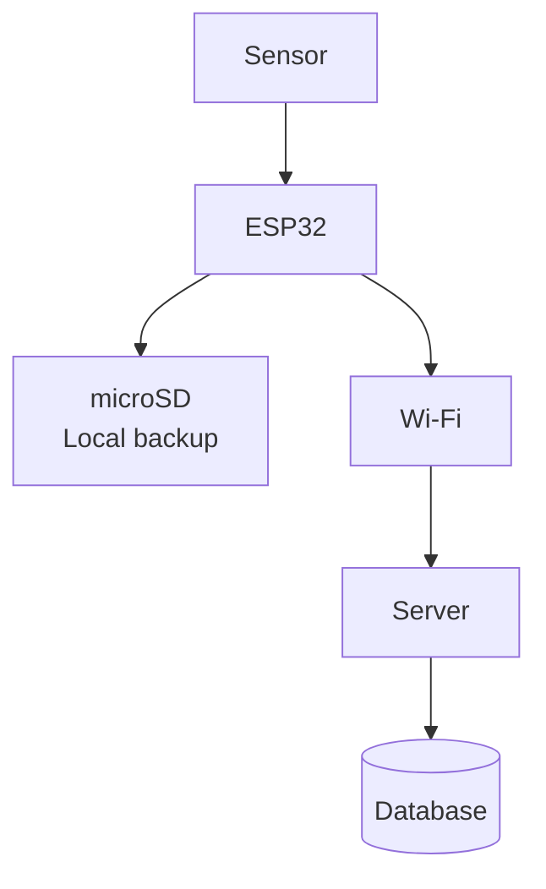
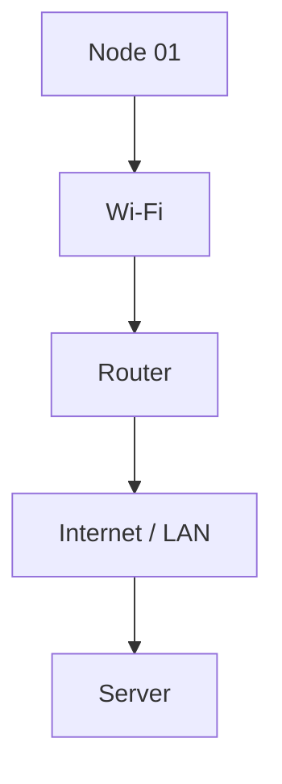
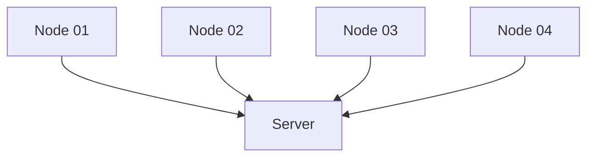
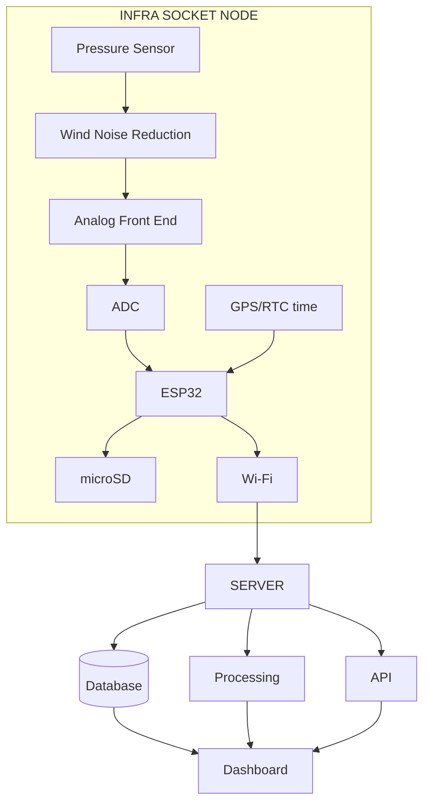
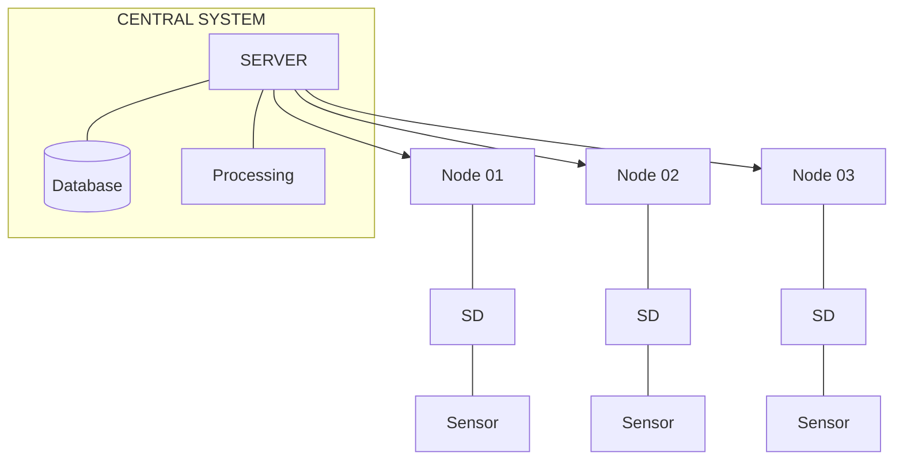

# Sensor Connection Architecture

## Storage Calculations

Suppose one sensor records:
- **Sampling rate:** 100 samples/second
- **Data:** 4 bytes/sample

### 32-bit Data (4 bytes/sample)
**Raw Data Calculation:**
* 100 samples/second × 4 bytes = 400 bytes/second

**Approximate Storage Requirements:**
* 34.6 MB/day
* ≈ 1.04 GB/month
* ≈ 12.6 GB/year

*Note: That's for one channel, before considering timestamps, headers, and metadata.*

### 16-bit Data (2 bytes/sample)
**Raw Data Calculation:**
* 100 samples/second × 2 bytes = 200 bytes/second

**Approximate Storage Requirements:**
* ≈ 17.3 MB/day
* ≈ 0.52 GB/month
* ≈ 6.3 GB/year

**Conclusion:** A 32 GB card is already quite useful for a prototype.

---

## Benefits of Local Storage

A better architecture leverages both local and remote storage:

* The microSD acts as a local backup/buffer.
* The server becomes the main long-term storage.

### Standard Workflow
1. **ESP32** records data from the sensor.
2. Data is saved to the **microSD** card.
3. Data is sent through **Wi-Fi**.
4. **Server** receives the data.
5. Data is stored in the **Database**.

### Store-and-Forward Approach (Wi-Fi Failure)
If Wi-Fi fails:
1. Wi-Fi connection is lost (❌).
2. **Sensor** continues to send data to the **ESP32**.
3. **ESP32** continues recording to the **microSD** card.

When Wi-Fi comes back:
1. **ESP32** retrieves missing data from the **microSD** card.
2. **ESP32** uploads the missing data to the **Server**.

---

## Wi-Fi Usage

Wi-Fi is primarily used for communication, not storage. Your sensor node can send the following telemetry to your server:
- Pressure
- Temperature
- Timestamp
- Node ID
- Battery status
- Signal quality

**Communication Flow:**

You can then see the data on your dashboard.

---

## Server Uses

The server is the central brain and storage system for all your sensor nodes.

The server can perform several critical functions:

* **Store:** Historical sensor data.
* **Process:** Filtering, FFT (Fast Fourier Transform), Spectrogram, Feature extraction.
* **Compare:** Node 01 vs Node 02 vs Node 03.
* **Detect Events:** When multiple nodes detect the same event, it performs Event Correlation.
* **Display (Web Dashboard):** Live waveform, Frequency spectrum, Spectrogram, Sensor status, and Events.

---

## Infra Socket Node Architecture

---

## Multiple Locations Architecture

For multiple locations, the system architecture scales out:

Each node can have its own 32 GB microSD, while the server can have much larger centralized storage.