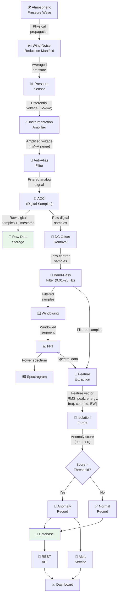
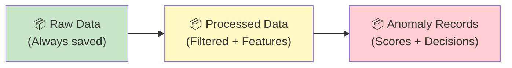

# Data Flow

## End-to-End Data Flow Diagram

## Data Types at Each Stage

| Stage | Data Type | Format | Approximate Size |
|---|---|---|---|
| Wind-noise manifold output | Air pressure | Physical (pneumatic) | N/A |
| Sensor output | Differential voltage | Analog (µV to mV) | N/A |
| Amplifier output | Amplified voltage | Analog (mV to V) | N/A |
| ADC output | Digital samples | Integer (16–24 bit) | 2–3 bytes per sample |
| Raw data record | Timestamp + sample | `{timestamp, value, temperature}` | ~20 bytes per record |
| Filtered signal | Digital samples | Float array | ~4 bytes per sample |
| FFT output | Complex spectrum | Complex float array | ~8 bytes per bin |
| Spectrogram | Time-frequency matrix | 2D float array | Varies with window/overlap |
| Feature vector | Numerical features | Float array (6–10 values) | ~40–80 bytes |
| Anomaly score | Single value | Float (0.0–1.0) | 4 bytes |
| Anomaly record | Structured record | JSON / DB record | ~200–500 bytes |

## Data Flow Rates

`Assumption`: Based on a 50 Hz sampling rate (chosen to provide margin above the 40 Hz Nyquist minimum).

| Stage | Data Rate | Notes |
|---|---|---|
| ADC samples | 50 samples/sec | ~100 bytes/sec (16-bit) |
| Raw data storage | ~1 KB/sec | With timestamp and metadata overhead |
| Signal processing | Window every 10–60 sec | Processing triggered per window |
| Feature extraction | 1 vector per window | 6–10 features per vector |
| AI inference | 1 score per window | Milliseconds per inference |
| Dashboard updates | 1–5 updates/sec | Waveform updates in near real-time |

## Data Persistence Points

Data is persisted at three key stages to ensure no data is lost:

1. **Raw Data (Green):** Always saved immediately after digitization. Even if all downstream processing fails, raw data is preserved.
2. **Processed Data (Yellow):** Saved after signal processing and feature extraction.
3. **Anomaly Records (Red):** Saved with each anomaly detection decision (whether normal or anomaly).

## Failure Scenarios and Data Preservation

| Failure | Data Impact | Mitigation |
|---|---|---|
| AI service crashes | Raw and processed data still saved | AI runs independently; restart recovers |
| Signal processing fails | Raw data still saved | Can reprocess from stored raw data |
| Database unavailable | Data queued in memory buffer | Write-ahead buffer; retry on reconnection |
| Dashboard disconnected | No data loss; all data in DB | Dashboard reconnects and catches up |
| Power failure | Data lost only for the outage period | UPS recommended; journal-mode database for crash recovery |

---

*See also: [Architecture](architecture.md) | [Component Interaction](component-interaction.md) | [Data Model](../07-data/data-model.md)*
