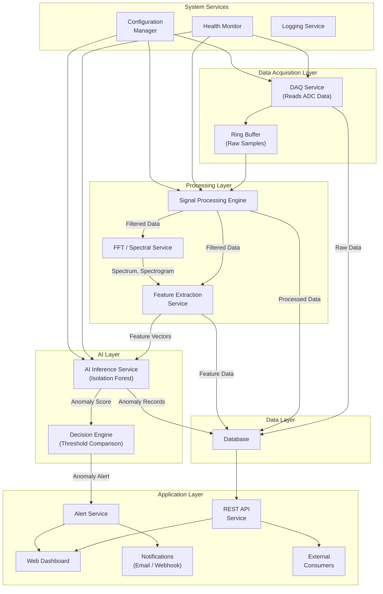

# Software Architecture

## Software Architecture Diagram

## Service Descriptions

### Data Acquisition Service (DAQ Service)
- **Responsibility:** Interface with the ADC hardware, read raw digital samples, buffer them, and make them available to downstream services
- **Input:** Digital samples from ADC (via serial, USB, SPI, or network)
- **Output:** Raw sample stream to ring buffer and database
- **Key behaviours:**
  - Continuous sampling at the configured rate
  - Timestamp each sample with a synchronized clock
  - Detect and log data gaps or hardware communication errors
  - Continue recording even if downstream processing fails

### Signal Processing Engine
- **Responsibility:** Apply digital filtering, DC offset removal, and prepare data for spectral analysis
- **Input:** Raw samples from the ring buffer
- **Output:** Filtered signal data, passed to FFT and feature extraction
- **Key operations:**
  - DC offset removal (subtract running mean)
  - Band-pass filtering (0.01–20 Hz)
  - Signal windowing for spectral analysis

### FFT / Spectral Service
- **Responsibility:** Compute frequency-domain representations
- **Input:** Filtered, windowed signal segments
- **Output:** Power spectrum, spectrogram data
- **Key operations:**
  - FFT computation
  - Power spectral density estimation
  - Spectrogram generation (successive overlapping FFTs)

### Feature Extraction Service
- **Responsibility:** Compute numerical features from each signal window
- **Input:** Filtered signal data, spectral data
- **Output:** Feature vectors for AI inference
- **Features computed:** RMS amplitude, peak amplitude, spectral energy, dominant frequency, spectral centroid, bandwidth

### AI Inference Service
- **Responsibility:** Run the trained Isolation Forest model on incoming feature vectors
- **Input:** Feature vectors from the feature extraction service
- **Output:** Anomaly scores
- **Key behaviours:**
  - Load the trained model at startup
  - Process each feature vector and output a score
  - Handle model loading failures gracefully (log error, continue without AI)
  - Support model hot-reloading for updates

### Decision Engine
- **Responsibility:** Compare anomaly scores against the configured threshold
- **Input:** Anomaly scores
- **Output:** NORMAL / ANOMALY classification, trigger alerts
- **Configuration:** Threshold value, cooldown period (to avoid repeated alerts for the same event)

### Database
- **Responsibility:** Persistent storage of all data
- **Stored entities:**
  - Raw measurements
  - Processed signal data
  - Feature vectors
  - Anomaly records
  - Sensor metadata
  - System logs

### REST API Service
- **Responsibility:** Provide HTTP endpoints for data access and system control
- **Consumers:** Dashboard, external applications
- **Endpoints:** See [API Design](../06-software/api-design.md)

### Web Dashboard
- **Responsibility:** Real-time visualization of system state
- **Displays:** Waveform, spectrum, spectrogram, anomaly score, alerts, sensor health
- **Technology:** Web-based (accessible via browser)

### Alert Service
- **Responsibility:** Generate and deliver notifications when anomalies are detected
- **Channels:** Dashboard notification, email, webhook (`Assumption`: notification channels to be determined based on implementation)

### Health Monitor
- **Responsibility:** Monitor the health of all services and hardware connections
- **Checks:** DAQ connectivity, processing latency, AI service status, database connectivity, disk space

### Configuration Manager
- **Responsibility:** Manage system configuration (sampling rate, filter parameters, AI threshold, alert settings)
- **Source:** Configuration file or database

### Logging Service
- **Responsibility:** Centralized logging for debugging, auditing, and monitoring

## Inter-Service Communication

`Assumption`: The communication patterns below represent the proposed design. The specific implementation (message queue, shared memory, direct function calls) depends on the chosen technology stack.

| Pattern | Used Between | Rationale |
|---|---|---|
| In-process (function calls) | Signal processing stages | Low latency, simple for monolithic prototype |
| Message queue / stream | DAQ → Processing → AI | Decoupled, buffered, supports backpressure |
| REST / HTTP | API → Dashboard | Standard web communication |
| Database writes/reads | All services → DB | Persistent storage |

For the **MVP prototype**, a monolithic architecture (all services in one process) is acceptable and simpler. Microservice separation is `Future Scope` for production deployments.

---

*See also: [Architecture](architecture.md) | [Data Flow](data-flow.md) | [Backend](../06-software/backend.md)*
