# System Overview

## What Is Infrasense?

Infrasense is an integrated monitoring system that detects, digitizes, processes, and analyzes very-low-frequency atmospheric pressure waves (infrasound) in the **0.01–20 Hz** range.

> **Simple Explanation:**
> Think of Infrasense as a specialized "listening station" for sounds too low for human ears — pressure waves that travel through the atmosphere at frequencies below what any microphone or ear can detect. It captures these invisible waves, converts them to digital data, and uses artificial intelligence to determine whether something unusual is happening.

## System Layers

The system is organized into four primary layers:

```mermaid
flowchart TD
    subgraph L1["Layer 1: Physical Sensing"]
        direction LR
        WNR["Wind-Noise Reduction"] --> PS["Pressure Sensor"]
        PS --> RC["Reference Chamber"]
    end

    subgraph L2["Layer 2: Signal Conditioning & Digitization"]
        direction LR
        AFE["Analog Front End"] --> ADC["ADC"]
    end

    subgraph L3["Layer 3: Digital Processing & AI"]
        direction LR
        SP["Signal Processing"] --> FE["Feature Extraction"]
        FE --> AI["AI Anomaly Detection"]
    end

    subgraph L4["Layer 4: Application"]
        direction LR
        DB["Database"] --> DASH["Dashboard"]
        DB --> API["API"]
        AI2["Alert System"] --> DASH
    end

    L1 --> L2
    L2 --> L3
    L3 --> L4
```

### Layer 1: Physical Sensing
The hardware layer that interfaces with the physical atmosphere. It includes wind-noise reduction, pressure sensing, and the reference chamber for differential measurement.

### Layer 2: Signal Conditioning & Digitization
The analog electronics that amplify, filter, and digitize the raw pressure signal. This layer bridges the physical world and the digital processing world.

### Layer 3: Digital Processing & AI
Software that processes the digitized signal through filtering, FFT, feature extraction, and anomaly detection. This is where signal processing (deterministic math) meets AI (learned models).

### Layer 4: Application
User-facing components: data storage, REST API, real-time dashboard, and alert system.

## Key Design Principles

| Principle | Description |
|---|---|
| **Modularity** | Each layer operates independently with defined interfaces |
| **Fail-safe operation** | If AI fails, sensor data is still recorded |
| **Transparency** | Raw data is always preserved alongside processed results |
| **Simplicity for MVP** | Use well-understood techniques before exploring complex alternatives |
| **Honest metrics** | No performance claims without measured evidence |

## Signal Flow Summary

| Step | Domain | Technology |
|---|---|---|
| Atmospheric pressure wave arrives | Physical | Nature |
| Wind noise reduced by manifold | Physical/Mechanical | Spatial averaging |
| Pressure converted to electrical signal | Transduction | Sensor + reference chamber |
| Electrical signal amplified and filtered | Analog electronics | Instrumentation amplifier, filters |
| Analog signal digitized | Analog → Digital | ADC |
| Digital signal filtered and transformed | Digital signal processing | Band-pass filter, FFT |
| Features extracted from signal windows | Digital signal processing | RMS, energy, spectral features |
| Anomaly score computed | Machine learning | Isolation Forest |
| Results stored and displayed | Software | Database, dashboard, API |

---

*See also: [Architecture](architecture.md) | [Hardware Architecture](hardware-architecture.md) | [Software Architecture](software-architecture.md)*
