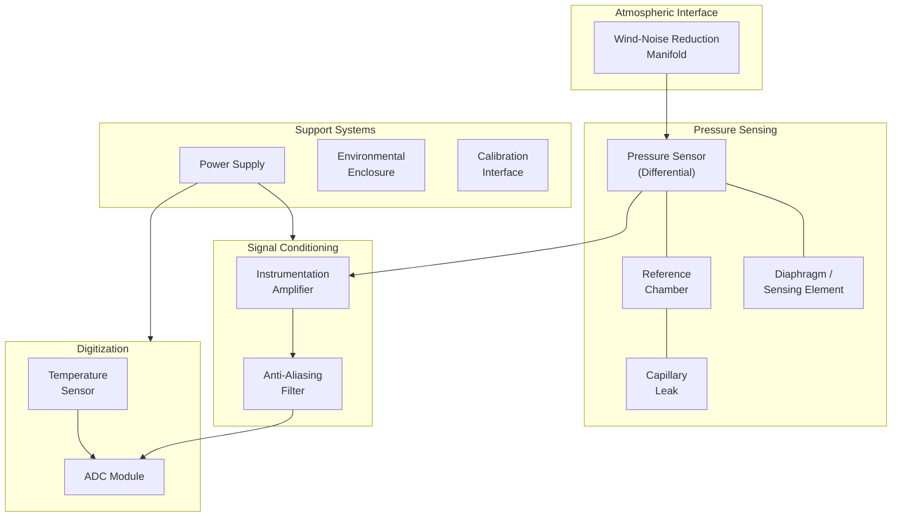

# Hardware Overview

## Introduction

The Infrasense hardware subsystem is responsible for the physical interface between the atmosphere and the digital processing system. It captures very-low-frequency atmospheric pressure waves (0.01–20 Hz), reduces environmental noise, conditions the electrical signal, and digitizes it for software processing.

> **Simple Explanation:**
> The hardware is like a very sensitive "atmospheric microphone" — but instead of listening to audible sound, it measures extremely slow pressure changes in the air. Because these changes are so small and slow, every part of the hardware must be carefully designed to avoid adding noise or losing the signal.

## Hardware Subsystem Map

## Hardware Components Summary

| Component | Purpose | Key Requirement |
|---|---|---|
| [Wind-noise reduction manifold](wind-noise-reduction.md) | Reduce turbulent wind-induced pressure noise | Multiple spatially distributed inlets |
| [Pressure sensor](pressure-sensing.md) | Convert pressure variations to electrical signal | Response down to 0.01 Hz, differential capability |
| [Diaphragm / sensing element](diaphragm-design.md) | Mechanical element that deflects under pressure | Sensitivity, linearity, low hysteresis |
| [Reference chamber](reference-chamber.md) | Provide stable reference pressure | Sealed volume with controlled capillary leak |
| [Differential pressure system](differential-pressure-system.md) | Suppress slow barometric drift | Atmosphere vs. reference chamber |
| [Instrumentation amplifier](analog-front-end.md) | Amplify weak sensor output | Low noise, high CMRR, low offset drift |
| [Anti-aliasing filter](analog-front-end.md) | Prevent aliasing during digitization | Low-pass, cutoff below half sampling rate |
| [ADC](adc-digitization.md) | Digitize the analog signal | ≥16-bit resolution, ≥40 Hz sampling rate |
| [Temperature sensor](temperature-sensing.md) | Monitor ambient/enclosure temperature | Accurate, low self-heating |
| [Power supply](power-system.md) | Provide clean, stable power | Low noise, regulated output |
| [Environmental enclosure](environmental-enclosure.md) | Protect electronics | Weather-resistant, thermally insulating |
| [Calibration interface](calibration.md) | Enable calibration procedures | Access to sensor port, reference input |

## Design Philosophy

### 1. Noise Budget Awareness
Every component in the signal chain adds noise. The overall system noise floor is determined by the noisiest component. Design priority is given to minimizing noise in the sensor and front-end amplifier — the first elements in the signal chain.

### 2. Simplicity for Prototype
The prototype should use the simplest hardware configuration that meets the minimum requirements. Complex multi-stage amplification or exotic sensor technologies are deferred unless justified by testing.

### 3. Measurability
Every critical parameter (sensitivity, noise floor, frequency response) should be measurable through defined calibration procedures. The hardware design includes provisions for calibration access.

### 4. Modularity
The hardware is designed in modular subsystems that can be tested and upgraded independently:
- The wind-noise manifold can be improved without changing the sensor
- The sensor can be upgraded without changing the front-end electronics
- The ADC can be swapped for a higher-resolution unit

---

*See also: [Pressure Sensing](pressure-sensing.md) | [Wind-Noise Reduction](wind-noise-reduction.md) | [Analog Front End](analog-front-end.md)*
