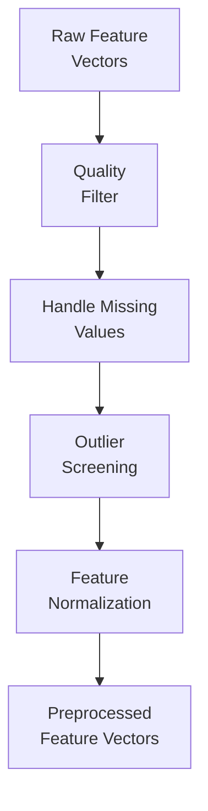

# Data Preprocessing

## Purpose

Data preprocessing transforms raw feature data into a form suitable for the Isolation Forest model. It ensures consistency between training and inference data.

## Preprocessing Pipeline



## Steps

### 1. Quality Filtering
Remove feature vectors from windows that failed signal quality checks (saturation, data gaps, sensor errors). Only `OK` quality data should be used for training.

### 2. Missing Value Handling
If any features are missing (e.g., because FFT failed for a window), the window should be excluded rather than imputed, since missing data in real-time sensor systems usually indicates a processing error.

### 3. Outlier Screening (Training Only)
During training, screen for extreme outliers in the feature data that may indicate sensor artefacts or processing errors. Simple statistical methods (e.g., values beyond 5 standard deviations from the mean) can be used. This step is NOT applied during inference — during inference, outliers are exactly what we want to detect.

### 4. Feature Normalization

**Standard Scaling (Z-score normalization):**
```
x_normalized = (x − μ) / σ

Where:
  μ = mean of the feature (computed from training data)
  σ = standard deviation (computed from training data)
```

**Important:**
- Compute μ and σ **only from the training data**
- Apply the **same μ and σ** to all new data during inference
- Save these parameters alongside the model

## Preprocessing Consistency

The exact same preprocessing steps and parameters must be applied during both training and inference. Any inconsistency will cause the model to behave unpredictably.

| Step | Training | Inference |
|---|---|---|
| Quality filter | Applied | Applied |
| Missing value handling | Exclude | Exclude |
| Outlier screening | Applied | **NOT applied** |
| Normalization parameters | Computed | Loaded from training |
| Normalization application | Applied | Applied |

---

*See also: [Dataset Strategy](dataset-strategy.md) | [Feature Engineering](feature-engineering.md) | [Model Training](model-training.md)*
