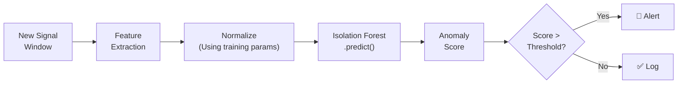

# Model Inference

## Inference Pipeline

Model inference is the process of using the trained Isolation Forest model to score new, unseen data in real-time.

## Inference Steps

1. **Feature extraction:** Compute the same features as during training, in the same order
2. **Normalization:** Apply the saved μ and σ values from training (NOT recomputed)
3. **Model prediction:** Call `model.decision_function()` or `model.score_samples()` to get the anomaly score
4. **Threshold comparison:** Compare against the configured threshold
5. **Action:** Log result; if anomalous, trigger alert

## Performance Requirements

| Metric | Target | Rationale |
|---|---|---|
| Inference latency | < 100 ms per window | Real-time responsiveness |
| Memory usage | < 50 MB for model | Fits on edge hardware |
| CPU usage | < 10% (single core) | Leaves resources for other services |

`Assumption`: Isolation Forest with 100 trees and ~15 features should easily meet these targets on a Raspberry Pi 4 or equivalent.

## Failure Handling

| Failure | Handling |
|---|---|
| Model file missing | Log error; continue recording data without AI scoring |
| Feature extraction error | Skip window; log error |
| Model prediction error | Log error; continue with next window |
| Score is NaN / invalid | Treat as unknown; do not trigger alert or log as normal |

**Key principle:** If the AI model fails, the system continues recording sensor data. AI failure should never cause data loss.

---

*See also: [Model Training](model-training.md) | [Threshold Selection](threshold-selection.md) | [Anomaly Detection](anomaly-detection.md)*
