# Real-Time Processing

## Overview

Real-time processing ensures that sensor data is continuously acquired, processed, analyzed, and visualized with minimal latency.

## Processing Timeline

```mermaid
gantt
    title Real-Time Processing Timeline (per 30-second window)
    dateFormat ss
    axisFormat %S sec

    section Data Acquisition
        Continuous ADC sampling  :a1, 00, 30s

    section Processing
        DC removal + Filtering   :p1, 30, 1s
        FFT + Spectrogram        :p2, after p1, 1s
        Feature extraction       :p3, after p2, 1s

    section AI
        Isolation Forest inference :ai1, after p3, 1s

    section Output
        Database write           :o1, after ai1, 1s
        Dashboard update         :o2, after ai1, 1s
        Alert (if anomaly)       :o3, after ai1, 1s
```

## Latency Budget

| Stage | Expected Latency | Notes |
|---|---|---|
| Data acquisition (window fill) | 30 seconds | Window accumulation time |
| Signal processing | < 500 ms | Filtering + FFT on ~1500 samples |
| Feature extraction | < 100 ms | Simple arithmetic operations |
| AI inference | < 100 ms | Isolation Forest is fast |
| Database write | < 100 ms | Local database |
| Dashboard push | < 200 ms | WebSocket or polling |
| **Total pipeline** | **~31 seconds** | Dominated by window accumulation |

The practical detection latency is approximately one window length (30 seconds) plus processing time (~1 second).

## Streaming Architecture

Data flows through the pipeline as a continuous stream:

- ADC samples arrive continuously at 50 Hz
- The dashboard waveform can update at a higher rate (e.g., every 1–2 seconds) using the raw sample buffer
- Feature extraction and AI inference run on each completed analysis window

---

*See also: [Backend](backend.md) | [Signal Processing Overview](../04-signal-processing/signal-processing-overview.md)*
