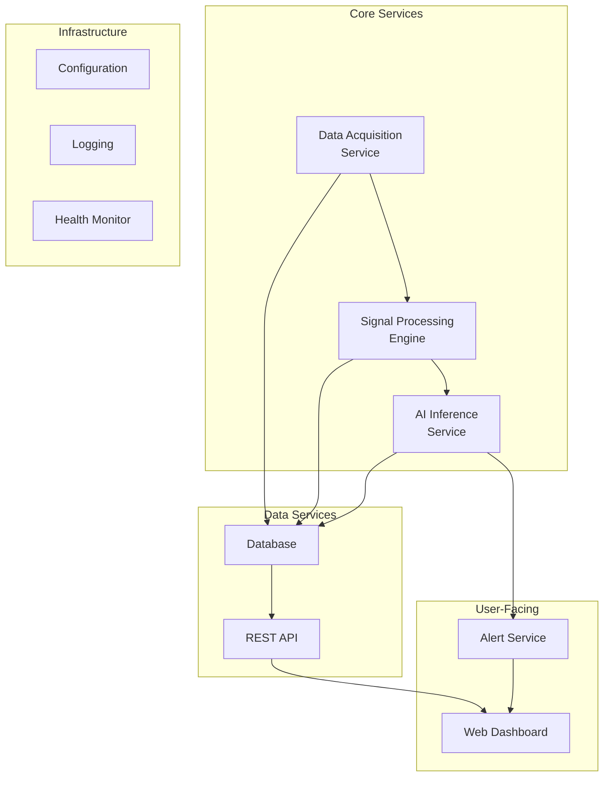

# Software Overview

## Architecture

The Infrasense software stack handles data acquisition, signal processing, AI inference, data storage, API services, real-time visualization, and alerting.

## Technology Considerations

`Assumption`: The technology stack is not finalized. The following are technology-neutral descriptions with recommended options.

| Component | Recommended Options | Notes |
|---|---|---|
| Language | Python | Rich ecosystem for signal processing (NumPy, SciPy) and ML (scikit-learn) |
| Database | SQLite (prototype) or PostgreSQL (production) | SQLite is simplest for single-station deployment |
| API framework | Flask, FastAPI | Lightweight Python web frameworks |
| Dashboard | Web-based (HTML/CSS/JS with charting library) | Chart.js, Plotly, or similar |
| AI library | scikit-learn | Isolation Forest implementation included |
| Signal processing | NumPy, SciPy | FFT, filtering, windowing |

---

*See also: [Backend](backend.md) | [API Design](api-design.md) | [Dashboard](dashboard.md)*
