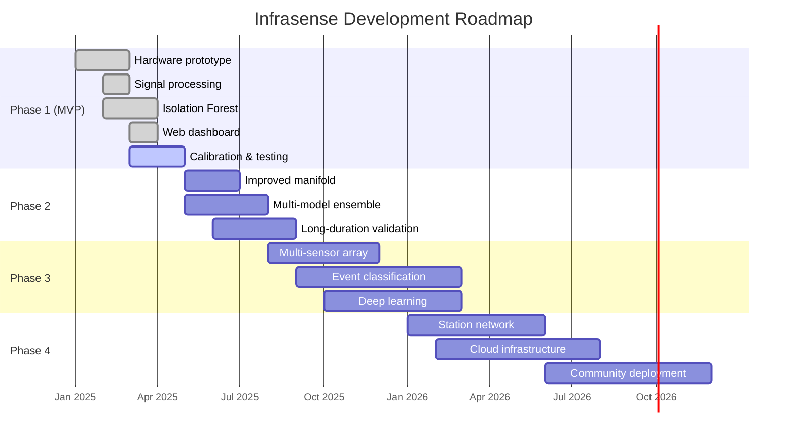

# Future Scope

## Planned Phases

`Assumption`: This roadmap is aspirational. Timelines depend on available resources, team availability, and research progress.

## Phase 2: Improved Performance
- Larger wind-noise manifold with more inlets
- Ensemble anomaly detection (Isolation Forest + Local Outlier Factor + One-Class SVM)
- Extended field validation over weeks/months
- Temperature compensation for sensor drift
- Improved dashboard with historical analysis tools

## Phase 3: Advanced Capabilities
- **Multi-sensor array:** Deploy 3+ sensors in an array for source direction estimation
- **Event classification:** Train supervised models on labeled infrasound datasets to classify anomalies by type (storm-like, explosion-like, etc.)
- **Deep learning:** Use Convolutional Neural Networks (CNNs) on spectrogram images for pattern recognition
- **Array processing:** Cross-correlation methods (PMCC-like) for signal detection and azimuth estimation

## Phase 4: Network and Scale
- **Multi-station network:** Deploy stations at multiple locations reporting to a central server
- **Cloud processing:** Move heavy computation (deep learning, batch analysis) to cloud infrastructure
- **Community deployment:** Provide build guides, kits, and software for other groups to deploy their own stations
- **Open data:** Share anonymized infrasound data for community research

## Technology Evolution

| Capability | MVP | Phase 2 | Phase 3 | Phase 4 |
|---|---|---|---|---|
| Sensors | 1 | 1 (improved) | 3–8 (array) | Multiple stations |
| AI | Isolation Forest | Ensemble | Classification + DL | Distributed inference |
| Dashboard | Single station | Enhanced | Array visualization | Network map |
| Alerts | Dashboard | Dashboard + email | Multi-level | Global |
| Data | Local SQLite | Local PostgreSQL | Central DB | Cloud + distributed |

---

*See also: [Phase Plan](phase-plan.md) | [Contribution Guide](contribution-guide.md)*
